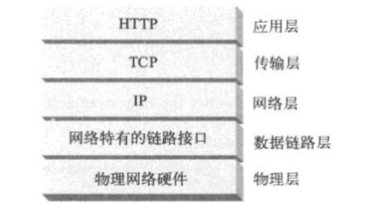
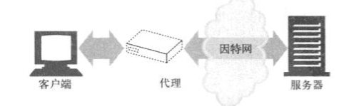
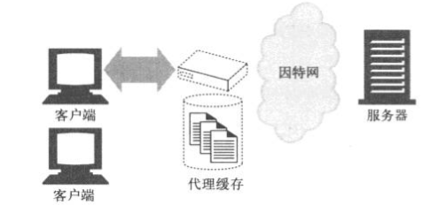
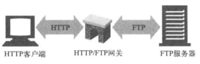
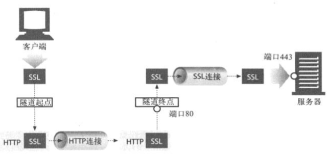

# HTTP 概述

## 1 概念
HTTP：超文本传输​​协议（HTTP HyperText Transfer Protocol）是用于传输诸如HTML的超媒体文档的应用层协议。它被设计用于Web浏览器和Web服务器之间的通信，但它也可以用于其他目的。
HTTP遵循经典的客户端-服务端模型，客户端打开一个连接以发出请求，然后等待它收到服务器端响应。
- HTTP是**无状态协议**，意味着服务器不会在两个请求之间保留任何数据（状态）。
- 虽然通常基于TCP / IP层，但可以在任何可靠的传输层上使用。即使数据来自地球另一端，也能确保数据在**传输过程中不被损坏或产生混乱**。

## 2 Web客户端 和 服务器

服务器：Web内容存储在Web服务器上；
客户端：例如浏览器。

## 3 资源
所有的内容来源都是资源。
Web服务器是Web 资源的宿主。 最简单的Web资源是服务器上的静态文件，这些文件包含 文本文件、HTML文件、Word文件、JPEG图片、AVI电影文件等。
资源不一定是静态文件，还可以是根据需要生成内容的软件程序。如购买礼物/搜索房产数据库等。

### 3.1 媒体类型

MIME(Multipurpose Internet Mail Extensions)：多用途互联网邮件扩展类型。是设定某种扩展名的文件用一种应用程序来打开的方式类型，
当该扩展名文件被访问的时候，浏览器会自动使用指定应用程序来打开。多用于指定一些客户端自定义的文件名，以及一些媒体文件打开方式。

常见MIME类型：
- HTML: text/html
- ASCII 文本：text/plain
- JPEG图片：image/jpeg
- GIF图片：image/gif
- Apple的AuickTime 电影：video/quicktime
- PowerPoint: application/vnd.ms-powerpoint

### 3.2 URI/URL

URI：统一资源标识符(Uniform Resource Identifier)，URI就像互联网上的邮政地址，在全世界内唯一标识并定位信息资源。
URI 有两种形式，**URL和URN**。

URL：统一资源定位符（Uniform Resource Locator）,是资源标识符最常见的形式 。URL描述了一台特定服务器上某资源的特定位置。
比如： http://www.oreilly.com/index.html.
URN：统一资源名（Uniform Resource Name），URN是作为特定内容的唯一名称使用的，与目前的资源所在地无关。
例如： urn:ietf:rfc:2141  互联网标准文档 RFC 2141

## 4 事务

一条HTTP事务由一条请求命令和一个响应结果组成。这种通信是通过HTTP报文的格式化数据块进行的。

### 4.1 方法
HTTP支持不同的请求命令，这些命令称为HTTP方法。如GET/POST/DELETE/HEAD等。

### 4.2 状态码
每条HTTP响应报文返回时会携带一个状态码。常见的状态码如 200/320/404 等。

## 5 报文
HTTP报文由一行一行简单字符串组成的 。从客户端发往服务器的报文是请求报文，从服务端发往客户端的是响应报文。

HTTP报文包含3 部分：
- 起始行： 报文的第一行为起始行，请求报文中说明要做些什么，响应报文中说明出现了什么情况。
- 首部字段：起始行后有0个或多个首部字段，每个字段都包含一个名字和一个值，使用冒号（：）分隔，首部以一个空行结束。
- 主体：空行之后是报文主体，其中包含了所有类型的数据。  起始行和首部都是文本形式且是结构化的，而主体可以包含任意的二进制数据（如图片/视频），也可是文本。

## 6 连接
### 6.1 TCP/IP

TCP(Transmission Control Protocol): 传输控制协议。
HTTP 是 应用层协议，无需操心网络通信的具体细节，它把联网的细节交给通用的、可靠的因特网传输协议 TCP/IP

TCP 提供：
1. 无差错的数据传输；
2. 按序传输（数据总是按照发送的顺序到达）
3. 未分段的数据流（可以在任意时刻以任意尺寸将数据发送出去）

### 6.2 连接/IP地址和端口号

浏览器与服务器交互步骤：
1. 浏览器从URL中解析出服务器的主机名；
2. 浏览器将服务器的主机名转换为IP地址（通过域名服务DNS 完成，将诸如 www.netscape.com 转换为 207.200.83.29）；
3. 浏览器将端口号（如果有）从URL中解析出来；
4. 浏览器建立一条与Web服务器的TCP连接；
5. 浏览器向服务器发送一条HTTP请求报文；
6. 服务器向浏览器回送一条HTTP响应报文；
7. 关闭连接，浏览器显示文档。

## 7 协议版本

HTTP/0.9 ：1991年原型版本；
HTTP/1.0 ：第一个广泛使用的版本；
HTTP/1.1 ：当前使用的HTTP版本；
HTTP/2.0 ：大幅优化的版本；

## 8 Web的结构组件

1. 代理： 位于客户端和服务器之间的HTTP中间实体
代理位于客户端和服务器之间，接收所有客户端的HTTP请求，并将这些请求转发给服务器（可能会对请求进行修改后转发）。
出于安全考虑，通常会将代理作为转发所有Web流量的可信任中间节点使用。代理还可以对请求和响应进行过滤，比如对下载的程序进行病毒检测/对小学生屏蔽成人内容等。

2. 缓存：HTTP的仓库，使常用页面的副本可以保存在离客户端更近的地方。
Web缓存（Web cache）或 代理缓存（proxy cache）是一种特殊的HTTP代理服务器，可以将经过代理传送的常用文档复制保存起来。下一个请求同一文档的客户端就可以享受缓存的私有副本所提供的服务。

3. 网关：连接其他应用程序的特殊Web服务器
网关（gateway）是一种特殊的服务器，作为其他服务器的中间实体使用。通常用于将HTTP流量转换为其他的协议。
例如一个HTTP/FTP 网关会通过HTTP请求接收对FTP URI的请求，但通过FTP协议获取文档。

4. 隧道：对HTTP通信报文进行盲转发的特殊代理
隧道（tunnel）是建立起来后，就会在2条连接之间对原始数据进行盲转发的HTTP应用程序，隧道通常用来在一条或多条HTTP连接上转发非HTTP数据，转发时不会窥探数据。
常见的用途如 通过HTTP连接承载加密的安全套接字层（SSL，secure sockets layer）流量，这样SSL流量就可以穿过只允许Web流量通过的防火墙。

5. Agent代理：发起自动HTTP请求的半智能Web客户端
用户Agent代理是代表用户发起HTTP请求的客户端程序，所有发布Web请求的应用程序都是HTTP Agent代理。常见的Agent代理有：浏览器/网络蜘蛛/Web机器人等。

