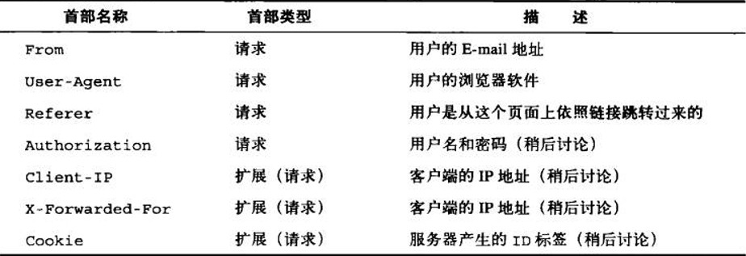
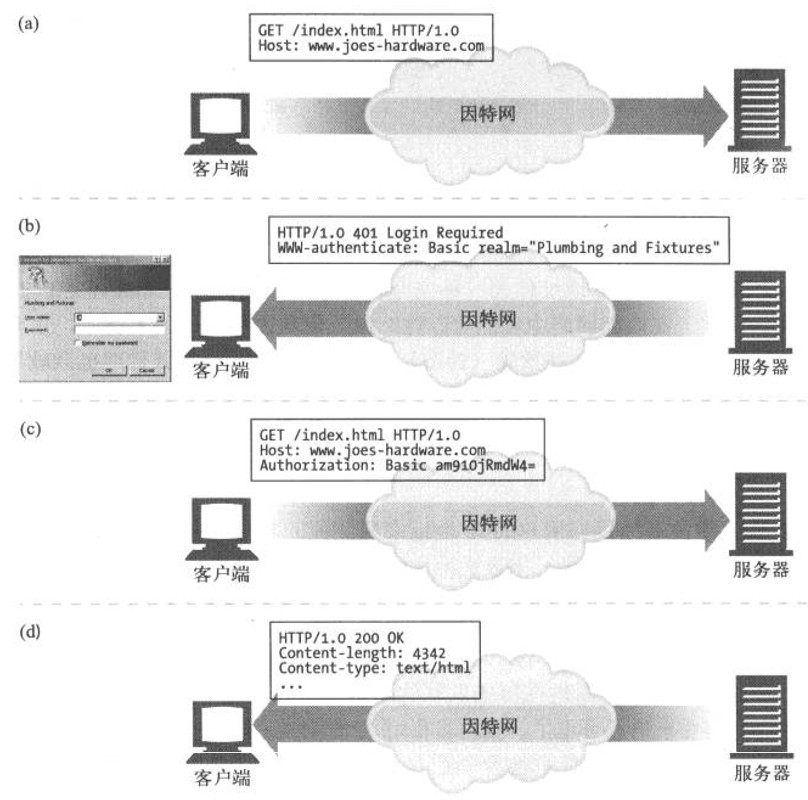
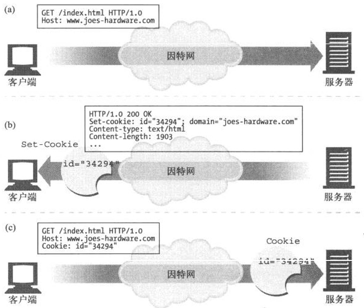

# HTTP之客户端识别和cookie

HTTP最初是一个匿名、无状态的请求/响应协议。服务器处理来自客户端的请求，然后向客户端回送一条响应。Web服务器几乎没有什么信息可以用来判定是哪个用户发送的请求，也无法记录来访用户的请求序列。
Web站点希望能够提供个性化接触。它们希望对连接另一端的用户有更多的了解，并且能在用户浏览页面时对其进行跟踪。以购物网站为例，专门为用户生成的欢迎词和页面内容，使购物体验更加个性化；
通过了解客户的兴趣，商店可以推荐一些它们认为客户会感兴趣的商品。商店还可以在临近客户生日或其他一些重要日子的时候提供生日特定的商品；在线购物的用户不喜欢一次又一次地填写繁琐的地址和信用卡信息。
下表中给出了七种最常见的用来承载用户相关信息的HTTP请求首部：



## 1 IP地址
早期Web曾尝试将客户端IP地址作为一种标识形式使用。如果每个用户都有不同的IP地址，**IP地址(如果会发生变化的话)也很少会发生变化**，而且Web服务器可以判断出每条请求的客户端IP地址的话，这种方案是可行的.

使用客户端IP地址来识别用户存在着很多缺点:
- 因为客户端IP地址描述的是所用的机器，而不是用户。如果多个用户共享同一台计算机，就无法对其进行区分了；
- 很多因特网服务提供商都会在用户登录时为其**动态分配IP地址**。用户每次登录时，都会得到一个不同的地址，因此Web服务器不能假设IP地址可以在各登录会话之间标识用户；
- 为了提高安全性，并对稀缺的地址资源进行管理，很多用户都是通过网络地址转换(Network Address Translation, NAT)防火墙来浏览网络内容的。
   这些NAT设备隐藏了防火墙后面那些实际客户端的IP地址，将实际的客户端IP地址转换成了一个共享的防火墙IP地址和不同的端口号；
- HTTP代理和网关通常会打开一些新的、到原始服务器的TCP连接。Web服务器看到的将是**代理服务器的IP地址**，而不是客户端的。
无法用IP地址确定目标的地方太多了。少数站点甚至将客户端IP地址作为一种安全特性使用，它们只向来自特定IP地址的用户提供文档。
在内部网络中可能可以这么做，但在因特网上就不行了，主要是因为因特网上IP地址太容易伪造了。路径上如果有拦截代理也会破坏此方案.

## 2 用户登录

Web服务器无需被动地根据用户的IP地址来猜测他的身份，它可以**要求用户通过用户名和密码进行认证登录来显式地询问用户是谁**.
为了使Web站点的登录更加简便，HTTP中包含了一种内建机制，可以用www- Authenticate首部和Authorization首部向Web站点传送用户的相关信息。
一旦登录，浏览器就可以不断地在每条发往这个站点的请求中发送这个登录信息了。这样，就总是有登录信息可用了.


## 3 胖URL

有些Web站点会为每个用户生成特定版本的URL来追踪用户的身份。通常，会**对真正的URL进行扩展**，在URL路径开始或结束的地方添加一些状态信息。
用户浏览站点时，Web服务器会动态生成一些超链，继续维护URL中的状态信息.


改动后包含了用户状态信息的URL被称为胖URL(fat URL)。下面是Amazon.com使用的一些胖URL实例。
每个URL后面都附加了一个用户特有的标识码，在这个例子中就是002-1145265-8016838，这个标识码有助于在用户浏览商店内容时对其进行跟踪

```
<a href="/exec/obidos/tg/browse/-/229220/ref=gr_gifts/002-1145265-8016838">All Gifts</a><br>
<a href="/exec/obidos/wishlist/ref=gr_pll_/002-1145265-8016838">Wish List</a><br>

```

可以在用户浏览站点时，用胖URL对其进行识别。但这种技术存在几个很严重的问题：
- 丑陋的URL——浏览器中显示的胖URL会给新用户带来困扰；
- 无法共享URL——胖URL中包含了与特定用户和会话有关的状态信息。如果将这个URL发送给其他人，可能就在无意中将个人信息都共享出去了；
- 破坏缓存——为每个URL生成用户特有的版本就意味着不再有可供公共访问的URL需要缓存了；
- 额外的服务器负荷——服务器需要重写HTML页面使URL变胖；
- 逃逸口——用户跳转到其他站点或者请求一个特定的URL时，就很容易在无意中“逃离”胖URL会话，只有当用户严格地追随预先修改过的链接时，胖URL才能工作。
如果用户逃离此链接，就会丢失他的进展(可能是一个已经装满了东西的购物车)信息，得重新开始；
- 在会话间是非持久的，除非用户收藏了特定的胖URL，否则用户退出登录时，所有的信息都会丢失.

## 4 cookie

cookie是当前识别用户，**实现持久会话的最好方式**。前面各种技术中存在的很多问题对它们都没什么影响，但是通常会将它们与那些技术共用，以实现额外的价值.


### 4.1 类型
可以笼统地将cookie分为两类：**会话cookie和持久cookie**。会话cookie是一种临时cookie，它记录了用户访问站点时的设置和偏好。用户退出浏览器时，会话cookie就被删除了。
持久cookie的生存时间更长一些，它们存储在硬盘上。浏览器退出，计算机重启时它们仍然存在。通常会用持久cookie维护某个用户会周期性访问的站点的配置文件或登录名.
会话cookie和持久cookie之间唯一的区别就是它们的过期时间。如果设置了Discard参数，或者没有设置Expires或Max-Age参数来说明扩展的过期时间，这个cookie就是一个会话cookie .


### 4.2 工作机制

用户首次访问Web站点时，Web服务器对用户一无所知。Web服务器希望这个用户会再次回来，所以想给这个用户“拍上”一个独有的cookie，这样以后它就可以识别出这个用户了。
cookie中包含了一个由**名字=值(namezvalue)这样的信息构成的任意列表**，并通过**Set-Cookie**或Set-Cookie2 HTTP响应(扩展)首部将其贴到用户身上去.
cookie中可以**包含任意信息**，但它们通常都只包含一个服务器为了进行跟踪而产生的独特的识别码。
比如，服务器会将一个表示id=”34294”的cookie贴到用户上去。服务器可以用这个数字来查找服务器为其访问者积累的数据库信息(购物历史、地址信息等).



但是，cookie并不仅限于ID号。很多Web服务器都会将信息直接保存在cookie中

```
Cookie： name "Brian Totty"; phone="555-1212"
```

### 4.3 cookie罐：客户端的状态

cookie的基本思想就是让浏览器积累一组服务器特有的信息，每次访问服务器时都将这些信息提供给它。因为浏览器要负责存储cookie信息，所以此系统被称为客户端侧状态(client-side state)。
这个cookie规范的正式名称为**HTTP状态管理机制(HTTP state management mechanism)**.

浏览器内部的cookie罐中可以有成百上千个cookie，但浏览器**不会将每个cookie都发送给所有的站点**。实际上，它们通常只向每个站点发送2-3个cookie。原因如下：
- 对所有这些cookie字节进行传输会严重降低性能。浏览器实际传输的cookie字节数要比实际的内容字节数多；
- cookie中包含的是服务器特有的名值对，所以对大部分站点来说，大多数cookie都只是无法识别的无用数据；
- 将所有的cookie发送给所有站点会引发潜在的隐私问题，那些不信任的站点也会获得只想发给其他站点的信息.

如： 浏览器只向服务器发送服务器产生的那些cookie。joes-hardware.com产生的cookie会被发送给joes-hardware.com，不会发送给bobs-books.com或marys-movies.com。。。。。


1. cookie的域属性

产生cookie的服务器可以向Set-Cookie响应首部添加一个Domain属性来控制哪些站点可以看到那个cookie。
比如，下面的HTTP响应首部就是在告诉浏览器将cookie user= "maryl7"发送给域".airtravelbargains.com"的所有站点:

Set-cookie: user="maryl7"; domain="airtravelbargains.com"

如果用户访问的是www.airtravelbargains.com、specials.airtravelbargains.com或任意以.airtravelbargains.com结尾的站点，下列Cookie首部都会被发布出去：

Cookie: user="maryl7"


2. cookie路径属性

cookie规范甚至允许用户将cookie与部分Web站点关联起来。可以通过**Path属性**来实现这一功能，在这个属性列出的URL路径前缀下所有cookie都是有效的


例如，某个Web服务器可能是由两个组织共享的，每个组织都有独立的cookie。
站点www.airtravelbargains.com可能会将部分Web站点用于汽车租赁——比如，http://www.airtravelbargains.com/autos/——用一个独立的cookie来记录用户喜欢的汽车尺寸。
可能会生成一个如下所示的特殊汽车租赁cookie:

Set-cookie: pref=compact; domain="airtravelbargains.com"; path=/autos/
如果用户访问http://www.airtravelbargains.com/specials.html，就只会获得这个cookie：

Cookie: user="maryl7"

但如果访问http://www.airtravelbargains.com/autos/cheapo/index.html，就会获得这两个cookie:

Cookie: user="maryl7"
Cookie: pref=compact


### 4.4 cookie 语法

```
Cookie: <cookie-list>
Cookie: name=value
Cookie: name=value; name2=value2; name3=value3
```


1. Expires=<date> 可选
cookie 的最长有效时间，形式为符合 HTTP-date 规范的时间戳。 如果没有设置这个属性，那么表示这是一个会话期 cookie 。一个会话结束于客户端被关闭时，这意味着会话期 cookie 在彼时会被移除。
然而，很多Web浏览器支持会话恢复功能，这个功能可以使浏览器保留所有的tab标签，然后在重新打开浏览器的时候将其还原。与此同时，cookie 也会恢复，就跟从来没有关闭浏览器一样。

2. Max-Age=<non-zero-digit> 可选
在 cookie 失效之前需要经过的秒数。一位或多位非零（1-9）数字。一些老的浏览器（ie6、ie7 和 ie8）不支持这个属性。
对于其他浏览器来说，假如二者 （指 Expires 和Max-Age） 均存在，那么 Max-Age 优先级更高。

3. Domain=<domain-value> 可选
指定 cookie 可以送达的主机名。假如没有指定，那么默认值为当前文档访问地址中的主机部分（但是不包含子域名）。与之前的规范不同的是，域名之前的点号会被忽略。
假如指定了域名，那么相当于各个子域名也包含在内了。

4. Path=<path-value> 可选
指定一个 URL 路径，这个路径必须出现在要请求的资源的路径中才可以发送 Cookie 首部。
字符  %x2F ("/") 可以解释为文件目录分隔符，此目录的下级目录也满足匹配的条件（例如，如果 path=/docs，那么 "/docs", "/docs/Web/" 或者 "/docs/Web/HTTP" 都满足匹配的条件）。

5. Secure 可选
一个带有安全属性的 cookie 只有在请求使用SSL和HTTPS协议的时候才会被发送到服务器。
然而，保密或敏感信息永远不要在 HTTP cookie 中存储或传输，因为整个机制从本质上来说都是不安全的，比如前述协议并不意味着所有的信息都是经过加密的。
注意：非安全站点（http:）已经不能再在 cookie 中设置 secure 指令了（在Chrome 52+ and Firefox 52+ 中新引入的限制）。

6. HttpOnly 可选
设置了 HttpOnly 属性的 cookie 不能使用 JavaScript 经由  Document.cookie 属性、XMLHttpRequest 和  Request APIs 进行访问，以防范跨站脚本攻击（XSS）。

### 4.5 cookie与缓存


缓存那些与cookie事务有关的文档时要特别小心。因为不希望给用户分配一个过去某些用户用过的cookie，或者更糟糕的是，向一个用户展示其他人私有文档的内容.
cookie和缓存的规则并没有很好地建立起来。下面是处理缓存时的一些指导性规则：

如果无法缓存文档，要将其标示出来。文档的所有者最清楚文档是否是不可缓存的。
- 如果文档**不可缓存，就显式地注明**——具体来说，如果除了Set-Cookie首部之外文档是可缓存的，就使用Cache-Control:no-cache="Sec-Cookie"。
- 更通用的做法是为可缓存文档使用Cache-Control:public，这样有助于节省Web中的带宽
- 缓存Set-Cookie首部时要小心。如果响应中有Set-Cookie首部，就可以对主体进行缓存，除非被告知不要这么做。
  但要注意对Set-Cookie首部的缓存。如果向多个用户发送了相同的Set-Cookie首部，可能会破坏用户的定位。

- 有些缓存在将响应缓存起来之前会删除Set-Cookie首部，但这样也会引发一些问题，因为在没有缓存的时候，通常都会有cookie贴在客户端上，但由缓存提供服务的客户端就不会有cookie了。
- 小心处理带有Cookie首部的请求。带有Cookie首部的请求到达时，就在提示我们，得到的结果可能是私有的。一定要将私有内容标识为不可缓存的，但有些服务器可能会犯错


### 4.6 安全性和隐私

cookie是可以禁止的，而且可以通过日志分析或其他方式来实现大部分跟踪记录，所以cookie自身并不是很大的安全隐患。
实际上，可以通过提供一个标准的审査方法在远程数据库中保存个人信息，并将匿名cookie作为键值，来降低客户端到服务器的敏感数据传送频率.
但是，潜在的滥用情况总是存在的。所以，在处理隐私和用户跟踪信息时，最好还是要小心一些。第三方Web站点使用持久cookie来跟踪用户就是一种最大的滥用。
将这种做法与IP地址和Referer首部信息结合在一起，这些营销公司就可以构建起相当精确的用户档案和浏览模式信息。


