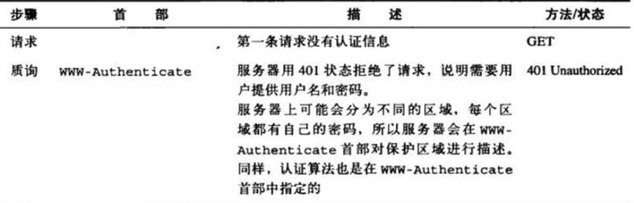
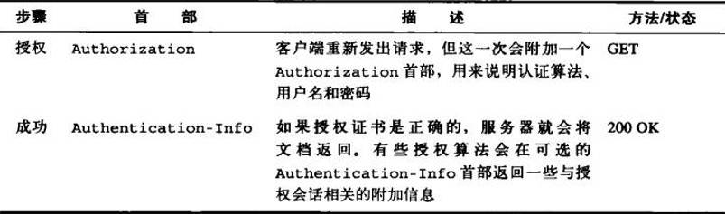
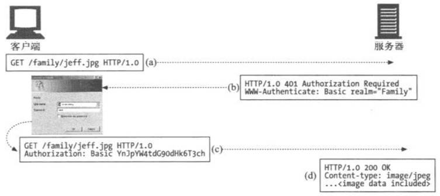
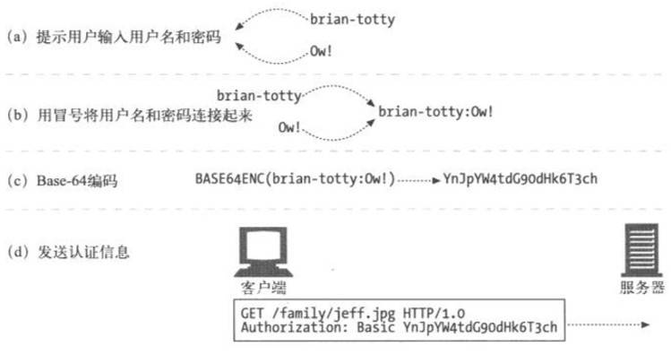
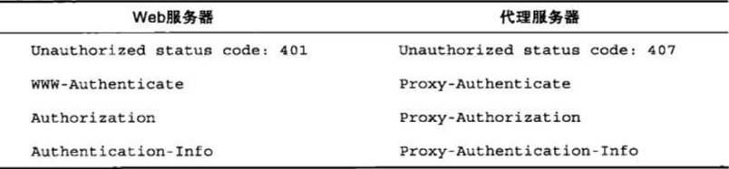

# 基本认证机制


人们用Web进行私人事务处理，访问私有的数据。通过Web可以很方便地访问这些信息，但仅仅是方便访问还是不够的。
我们要保证只有特定的人能看到我们的敏感信息并且能够执行我们的特权事务. 
 
认证就意味着要证明你是谁。通常是通过提供用户名和密码来进行认证的。
HTTP为认证提供了一种原生工具。尽管我们可以在HTTP的认证形式和cookie基础之上“运行自己的”认证工具，
但在很多情况下，HTTP的原生认证功能就可以很好地满足要求。 
 
## 1 认证协议与首部

HTTP通过一组可定制的控制首部，为不同的认证协议提供了一个可扩展框架。                             
HTTP定义了两个官方的认证协议：基本认证和摘要认证。今后人们可以随意设计一些使用HTTP质询/响应框架的新协议。        

    

 


关于基本认证的实例，如下图所示：

 


- 服务器对用户进行质询时，会返回一条401 Unauthorized响应，并在WWW-Authenticate首部说明如何以及在哪里进行认证；  

- 当客户端授权服务器继续处理时，会重新发送请求，但会在Authorization首部附上加密的密码和其他一些认证参数；           

- 授权请求成功完成时，服务器会返回一个正常的状态码(比如，200 OK)，对髙级认证算法来说，      
   可能还会在Authentication-Info首部附加一些额外的信息。       


### 1.1 安全域

在对基本认证的细节进行讨论之前，需要解释一下HTTP是怎样允许服务器为**不同的资源**使用**不同的访问权限**的。                 
上图的WWW-Authenticate质询中包含了一个realm指令。                           
Web服务器会将受保护的文档组织成一个安全域(security realm)。每个安全域都可以有不同的授权用户集.          


比如，假设Web服务器建立了两个安全域：一个用于公司的财务信息，另一个用于个人家庭文档。      
不同的用户对各个安全域的访问权限是不同的。公司的CEO应该能够访问销售额预测资料，   
但不应该允许他访问员工和其家人度假的照片.    

下面是一个假想的基本认证质询，它指定了一个域:

``` 

HTTP/1.0 401 Unauthorized
WWW-Authenticate： Basic realm="Corporate Financials"

```


## 2 基本认证

基本认证是最流行的HTTP认证协议(RFC 2617)。几乎每个主要的客户端和服务器都实现了基本认证机制。                 
在基本认证中，Web服务器可以拒绝一个事务，质询客户端，请用户提供有效的用户名和密码。                 
服务器会**返回401**状态码，而不是200状态码来初始化认证质询，并**用WWW-Authenticate响应首部**指定要访问的安全域。   
浏览器收到质询时，会打开一个对话框，请求用户输入这个域的用户名和密码。然后将用户名和密码稍加扰码，再用**Authorization请求首部**回送给服务器.                 


### 2.1 Base-64用户名/密码编码

HTTP基本认证将(由冒号分隔的)用户名和密码打包在一起，并用Base-64编码方式对其进行编码。              
简单来说，Base-64编码会将一个8位字节序列划分为一些6位的块。                 
用每个6位的块在一个特殊的由64个字符组成的字母表中选择一个字符，这个字母表中包含了大部分字母和数字.          


下图显示了使用Base-64编码的基本认证实例。在这个例子中，用户名为brian-totty，密码为Ow!。          
浏览器用冒号将用户名和密码连接起来，生成一个打包字符串brian-totty:Ow!。              
然后对这个字符串进行Base-64编码，变成一串乱码：YnJpYW4tdG90dHk6T3ch       



 

## 3 代理认证

中间的代理服务器也可以实现认证功能。有些组织会在用户访问服务器、LAN或无线网络之前，**用代理服务器对其进行认证**。
可以在代理服务器上对访问策略进行集中管理。因此，通过**代理服务器提供对某组织内部资源的统一访问控制**是一种很便捷的方式。        
这个过程的第一步就是通过代理认证(proxy authentication)来识别身份.       

代理认证的步骤与Web服务器身份验证的步骤相同。但首部和状态码都有所不同。      
下表列出了Web服务器和代理在认证中使用的状态码和首部的差异:        




## 4 安全缺陷

基本认证简单便捷，但并不安全。只能用它来防止非恶意用户无意间进行的访问，或将其与SSL这样的加密技术配合使用.


1. 基本认证会通过网络发送用户名和密码，这些用户名和密码都是以一种很容易解码的形式表示的。
实际上，**密码是以明文形式**传输的，任何人都可以读取并将其捕获(Base-64编码的用户名和密码可以很轻易地通过反向编码过程进行解码)。
如果有动机的第三方用户有可能会去拦截基本认证发送的用户名和密码，就要**通过SSL加密信道**发送所有的HTTP事务，或者使用**更安全的认证协议**，比如**摘要认证**.


2. 即使密码是以更难解码的方式加密的，第三方用户仍然可以捕获被修改过的用户名和密码，
并将修改过的用户名和密码一次一次地重放给原始服务器，以获得对服务器的访问权。没有什么措施可用来防止这些**重放攻击**.  

3. 即使将基本认证用于一些不太重要的应用程序，比如公司内部网络的访问控制或个性化内容的访问，一些不良习惯也会让它变得很危险。    
很多用户由于受不了大量密码保护的服务，会在这些服务间使用相同的用户名和密码。     
比如说，黑客会从免费的因特网邮件网站捕获明文形式的用户名和密码，然后会发现用同样的用户名和密码还可以访问重要的在线银行网站.    
   
4. 基本认证**没有提供**任何针对代理和作为中间人的**中间节点的防护措施**，它们没有修改认证首部，但却修改了报文的其余部分，
这样就严重地改变了事务的本质
   
5. 假冒服务器很容易骗过基本认证。如果在用户实际连接到一台恶意服务器或网关的时候，                   
能够让用户相信他连接的是一个受基本认证保护的合法主机，攻击者就可以请求用户输入密码，     
将其存储起来以备未来使用，然后捏造一条错误信息传送给用户.          


