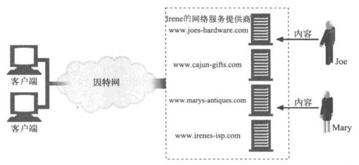
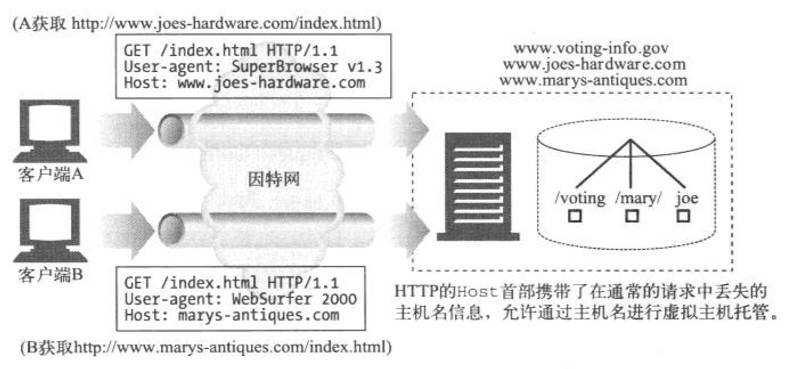
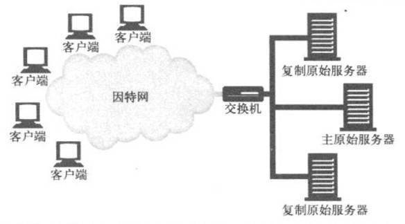
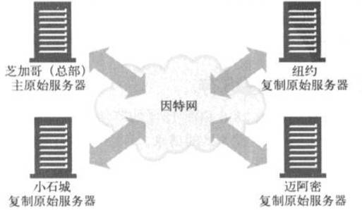

# Web主机托管

对内容资源的存储、协调以及管理的职责统称为Web主机托管。主机托管是Web服务器的主要功能之一。            
保存并提供内容，记录对内容的访问以及管理内容都离不开服务器。           
如果**不想自行管理**服务器所需的软硬件，就**需要主机托管服务**，即托管者。             


## 1 主机托管

随着Web迅速成为主流，每人都想要一个网站，但很少有人有能力或时间来搭建带空调的服务器机房，注册域名，或购买网络带宽。               
为了满足人们的迫切需求，出现了很多新的企业，**提供了专业化管理的Web主机托管服务**。              
服务级别有多种，从物理上的设备管理(提供空间、空调以及线缆)到完整的Web主机托管，顾客只需要提供内容就行了.            

在下图中，Joe和Mary都签约使用Irene的网络服务提供商提供的专用Web托 管服务。Joe租了专用的Web服务器，该服务器是Irene网络服务提供商购买和维护的。   
Mary也从Irene网络服务提供商那里租了另一个专用服务器。    




在这个例子中，浏览器向Joe服务器的IP地址发送对www.joes-hardware.com的HTTP请求，            
向Mary服务器(不同于Joe)的IP地址发送对www.marys-antiques.com的请求.                 


## 2 虚拟主机托管


许多Web托管者通过让一些顾客**共享一台计算机**来提供便宜的Web主机托管服务。这称为**共享主机托管或虚拟主机托管**。   
每个网站看起来是托管在不同的服务器上，但实际上是托管在同一个物理服务器上。   


### 2.1 主机信息

不幸的是，HTTP/1.0中的一个设计缺陷会使虚拟主机托管者抓狂。HTTP/1.0规范中没有为共享的Web服务器提供任何方法来识别要访问的是哪一个托管的网站.  

HTTP/1.0请求在报文中只发送了URL的路径部分。如果要访问http://www.joes-hardware.com/index.html，   
浏览器会连接到服务器www.joes-hardware.com，但HTTP/1.0请求中只提到GET/index.html，**没有提到主机名**。   
如果服务器虚拟托管了多个站点，就没有足够的信息能指出要访问的是哪个虚拟网站.     

如果客户端A试图访问http://www.joes-hardware.com/index.html，请求GET/index.html将被发送到共享的Web服务器.    
如果客户端B试图访问http://www.marys-antiques.com/index.html，同样的请求GET/index.html也将被发送到共享的Web服务器.   


缺失的主机信息是原始HTTP规范的疏忽，它错误地假设了每个Web服务器上只托管了一个网站。     
正因为如此，URL中的**主机名信息被当作冗余信息剥离**了，只要求发送路径部分.    


可以用以下4种技术解决：

1. 通过URL路径进行虚拟主机托管

可以通过分配不同的URL路径，用这种笨方法把共享服务器上的虚拟站点隔离开。例如，可以给每个逻辑网站一个专门的路径前缀：   

- Joe的五金商店可以是：http://www.joes-hardware.com/joe/index.html
- Mary的古董拍卖店可以是：http://www.marys-antiques.com/mary/index.html

当请求到达服务器时，其中并没有主机名信息，但服务器可以通过路径来区分它们：

- 请求Joe的五金商店的网址是GET /joe/index.html
- 请求Mary的古董拍卖店的网址是GET /mary/index.html

这**不是一个好办法**。/joe和/mary这样的前缀是多余的(主机名中已经提到joe了)
更糟的是，描述主页链接的常见约定：http://www.joes-hardware.com或http://www. joes-hardware.com/index.html 都不能用。        
 
2. 通过端口号进行主机托管

除了修改路径名，还可以在Web服务器上为Joe和Mary的网站分配不同的端口号。不再使用端口 80，而是采用其他端口号，
例如，Joe用82，Mary用83。但这个解决方案也有同样的问题：**终端用户不会乐意**在URL中指定非标准的端口号.   

3. 通过IP地址进行主机托管

为不同的虚拟站点分配专门的IP地址，把这些地址都绑定到一台单独的机器上。这样，Web服务器就可以通过IP地址来识别网站名了.  
一个更常用的、更好的方法是通过IP地址进行虚拟化。**每个虚拟网站都分配一个或多个唯一的IP地址**。所有虚拟网站的**IP地址都绑定到同一个共享的服务器**上。
服务器可以查询HTTP连接的目的IP地址，并以此来判断客户端的目标网站.  

比方说，托管者把IP地址209.172.34.3分配给www.joes-hardware.com，                
把IP地址209.172.34.4分配给www.marys-antiques.com，把这两个IP地址都绑定到同一个物理服务器上。             
Web服务器就能使用目的IP地址来识别用户请求的是哪个虚拟站点了.      

对大的托管者来说，虚拟IP的主机托管能够工作，但它会带来一些麻烦:

- a、在计算机系统上能绑定的**虚拟IP地址通常是有限制**的。想在共享的服务器上托管成百上千的虚拟站点的服务商不一定能实现愿望. 

- b、IP地址是稀缺资源。有很多虚拟站点的托管者不一定能为被托管的网站**获取足够多的IP地址**.  

- c、托管者通过复制服务器来增加容量时，IP地址短缺的问题就更严重了。随负载均衡体系的不同，可能会要求每个复制的服务器上有不同的虚拟IP地址，
因此IP地址的需求量可能会随复制服务器的数量而倍增.   

尽管虚拟IP的主机托管存在消耗地址的问题，但它**仍然得到了广泛的运用**.     


4. 通过Host首部进行虚拟主机托管

把主机名(和端口号)放在所有请求的Host扩展首部中传送.　　          
下图中，客户端A和客户端B都发送了携带有要访问的原始主机名的Host首部。               
当服务器收到对/index.html的请求时，可以通过Host扩展首部来判断要使用哪个资源.                   




## 3 Host首部

Host首部是HTTP/1.1的请求首部，定义在RFC 2068中。    

Host首部描述了所请求的资源所在的因特网主机和端口号，和原始的URL中得到的一样：

``` 

Host = "Host" ":" host [ ":" port
```
 
注意以下问题：
- 如果Host首部**不包含端口**，就使用地址方案中**默认的端口**；
- 如果URL中**包含IP**地址，Host首部就应当**包含同样**的地址；
- 如果URL中**包含主机名**，Host首部就必须包含**同样**的名字；
- 如果URL中**包含主机名**，Host首部就**不应当包含**URL中这个主机名对应的**IP地址**，因为这样会扰乱虚拟主机托管服务器的工作，   
  它在同一个IP地址上堆叠了很多虚拟站点；
- 如果URL中**包含主机名**，Host首部就**不应当包含**这个主机名的**其他别名**，因为这样也会扰乱虚拟主机托管服务器的工作；
- 如果客户端**显式地使用代理**服务器，客户端就必须把**原始服务器**，而不是代理服务器的名字和端口**放在Host**首部中。


对于**没有进行虚拟主机托管**，而且**不允许资源随请求主机的不同而变化的原始服务器**来说，**可以忽略Host**首部字段的值。  
但**资源会随主机名的不同而变化**的原始服务器，都必须在一条HTTP/1.1请求判断其所请求的资源时使用下列规则：

- 1、如果HTTP请求报文中的URL是绝对的(也就是说，包含方案和主机部分)，就忽略Host首部的值
- 2、如果HTTP请求报文中的URL没有主机部分，而该请求带有Host首部，则主机/端口的值就从Host首部中取
- 3、如果通过第(1)步或第(2)步都无法获得有效的主机，就向客户端返回400 Bad Request 响应


## 4 网站运作

在下面列出的这些时间段内，网站通常是无法运作的：  
- 服务器宕机的时候；
- 交通拥堵：  
- 突然间很多人都要看某个特别的新闻广播或涌向某个大甩卖网店。  

突然的拥堵可以使Web服务器过载，降低其响应速度，甚至使它彻底停机；网络中断或掉线。 
一些预判和处理这些常见问题的方法：

### 4.1 镜像的服务器集群

服务器集群是一排配置相同的Web服务器，**互相可以替换**。每个服务器上的内容可以通过镜像复制，这样当某个服务器出问题的时候，其他的可以顶上.    
镜像的服务器常常组成层次化的关系。某个服务器可能充当“内容权威”——它含有原始内容(可能就是内容作者上传的那个服务器)。
这个服务器称为**主原始服务器(master origin server)**。从主原始服务器接收内容的镜像服务器称为**复制原始服务器(replica origin server)**。
一种简单的部署服务器集群的方法是**用网络交换机把请求分发给服务器**。托管在服务器上的每个网站的IP地址就设置为交换机的IP地址.   



镜像Web服务器可以在**不同的地点包含同样内容的副本**。下图展示了4个镜像服务器，其中主服务器在芝加哥，复制服务器在纽约，迈阿密和小石城。
主服务器为芝加哥地区的客户端服务，并肩负把内容传播给复制服务器的任务.




在上图的场景中，有以下两种方法把客户端的请求导向特定的服务器            

-1 、HTTP重定向    
该内容的URL会解析到主服务器的IP地址，然后它会发送重定向到复制服务器.    

- 2、DNS重定向    
该内容的URL会解析到4个IP地址，DNS服务器可以选择发送给客户端的IP地址.     


### 4.2 内容分发网络(CDN)
简单地说，内容分发网络(CDN)就是**对特定内容进行分发的专门网络**。这个网络中的节点可以是Web服务器、反向代理或缓存.

1. CDN中的反向代理缓存
复制原始服务器可以用反向代理(也称为替代物)缓存来代替。反向代理缓存可以像镜像服务器一样接受服务器请求。   
它们代表原始服务器中的一个特定集合来接收服务器请求。根据内容所在的IP地址的广告方式，原始服务器和反向代理缓存之间通常有协作关系，   
到特定的原始服务器的请求就由反向代理缓存来接收.     

反向代理和镜像服务器之间的区别在于**反向代理通常是需求驱动的**。它们**不会**保存原始服务器的**全部内容副本**，它们只保存客户端请求的那部分内容。   
内容在其髙速缓存中的分布情况取决于它们收到的请求，原始服务器不负责更新它们的内容。  
为了更容易地访问“热点”内容(就是高请求率的内容)，有些反向代理具有“预取”特性，可以在用户请求之前就从服务器上载入内容.     


2. CDN中的代理缓存

与反向代理不同，传统的代理缓存能收到发往任何Web服务器的请求。在代理缓存与原始服务器之间不需要有任何工作关系或IP地址约定。
但是与反向代理比起来，代理缓存的内容一般都是按需驱动的，**不能指望它是对原始服务器内容的精确复制**。某些代理缓存也可以预先载入热点内容。   
按需驱动的代理缓存可以部署在其他环境中——尤其是拦截环境，在这种情况下，2层或3层设备(交换机或路由器)会拦截Web流量并将其发送给代理缓存。   


## 5 速访问
服务器**集群**和**分布式代理缓存**或**反向代理服务器**分散了网络流量，可以避免拥塞。分发内容使之更靠近终端用户，这样从服务器到客户端的传输时间就更短了。
请求和响应穿过因特网，在客户端和服务器间传输的方式是影响资源访问速度最主要的因素.    

加速网站访问的另一种方法是**对内容进行编码**以便更快地传输。比如，对内容进行**压缩**，但前提是接收的客户端能够把内容解压缩.          


 

