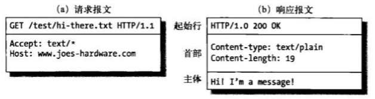
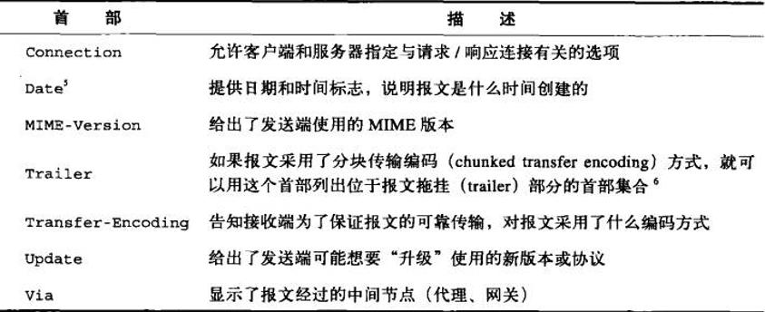
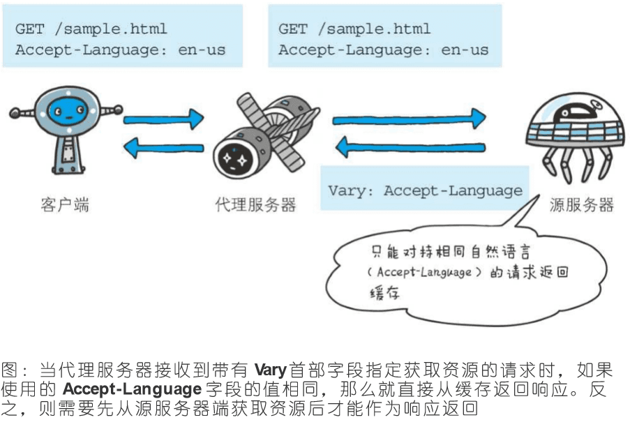
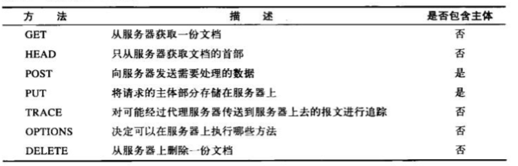
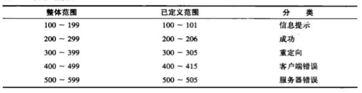

# HTTP 报文

HTTP报文：是在HTTP应用程序之间发送的简单的格式化数据块，每条报文都包含一条来自客户端的请求，或者一条来自服务器的响应。
它们由三个部分组成：由起始行（start line）、首部（header）和实体（body）的主体部分.

- 起始行和首部用空行分隔；
- 实体的主体可选，可以是文本、二进制数据，也可为空


# 1 报文分类
报文可分为请求报文和响应报文。

## 1.1 请求报文：

```
<method> <request-URL> <version>
<headers>
<entity-body>

```

- 方法(method)
客户端希望服务器对资源执行的动作。是一个单独的词，比如GET、HEAD或POST

- 请求 URL(request-URL)
命名了所请求资源，或者URL路径组件的完整URL

- 版本(version)
报文所使用的HTTP版本

- 首部(header)
可以有零个或多个首部，毎个首部都包含一个名字，后面跟着一个冒号(:)，然后是一个可选的空格，接着是一个值，最后是一个CRLF。首部是由一个空行(CRLF)结束的，表示了首部列表的结束和实体主体部分的开始

- 实体的主体部分(entity-body)
实体的主体部分包含一个由任意数据组成的数据块。并不是所有的报文都包含实体的主体部分，有时，报文只是以一个CRLF结束

## 1.2 响应报文：

```
<version><status><reason-phrase>
<headers>
<entity-body>
```

- 版本(version)：同上。

- 状态码(status-code)
这三位数字描述了请求过程中所发生的情况。每个状态码的第一位数字都用于描述状态的一般类别(“成功”、“出错”等)。

- 原因短语(reason-phrase)
数字状态码的可读版本，包含行终止序列之前的所有文本。

- 首部(header)：同上。

- 实体的主体部分(entity-body)：同上。



# 2 起始行

请求行：GET /test/hi-there.txt HTTP/1.1
响应行：HTTP/1.1 200 OK


# 3 首部
HTTP首部向请求和响应报文中添加了一些附加信息。可分为：
- 通用首部：请求报文/响应报文中均有
- 请求首部：适用于请求报文
- 响应首部：适用于响应报文
- 实体首部：描述主体的长度和内容，或者资源自身
- 扩展首部：规范中没有定义的新首部
示例：
Date:Tue,3Oct 1997 02:16:03 GMT
Content-length:15040
Content-type:image/gif

## 3.1 通用首部

有些首部提供了与报文相关的最基本的信息，它们被称为通用首部。

### 3.1.1 通用信息首部



1. Connection
Connection首部可以承载3种不同类型的标签：
- a、HTTP首部字段名，列出了只与此连接有关的首部；
- b、任意标签值，用于描述此连接的非标准选项；
- c、值close，说明操作完成之后需关闭这条持久连接
- d、值Keep-alive。
a、首部字段名
应用程序收到带有Connection首部的HTTP/1.1报文后，应该对列表进行解析，并删除报文中所有在Connection首部列表中出现过的首部。
它主要用于有代理网络环境，这样服务器或其他代理就可以指定不应传递的逐跳首部。

```
GET / HTTP/1.1
Upgrade:HTTP/1.1
Connection:Upgrade
```

转发后：（删除Connection中给出的首部）

```
GET / HTTP/1.1
```

b、任意标签值
任意标签值用于描述该连接。比如，如果是一个信用卡订单的连接.如：
Connection: bill-my-credit-card

c、close
HTTP1.1版本的默认连接是持久连接。当服务器端想明确断开连接时，则指定Connection首部字段的值是Close，如：Connection: close。

d、Keep-alive
HTTP1.0版本的默认连接都是非持久连接。因此，如果想在旧版本的HTTP协议上维持持久连接，需要将connection指定为keep-alive。

2. Date
Date首部给出了报文创建的日期和时间。服务器响应中要包含这个首部，因为缓存在评估响应的新鲜度时，要用到这个服务器认定的报文创建时间和日期。
对客户端来说，这个首部是可选的，但包含这个首部会更好 Date首部给出了报文创建的日期和时间。   HTTP/1.1 协议下示例：
Date: Tue, 03 Jul 2016 04:40:59 GMT

3. MIME-Version

MIME是HTTP的近亲。尽管两者存在根本区別，但有些HTTP服务器确实构造了一些在MIME规范下同样有效的报文。在这种情况下，服务器可以提供MIME版本的首部，例如：
MIME-Version: 1.0


4. Trailer

Trailer首部用于传输编码中，用于说明拖挂(在报文主体后记录)中提供了哪些首部，例如：
Trailer: Expires，**报文主体后面会追加Expires信息**

5. Transfer-Encoding
首部字段Transfer-Encoding规定了传输报文主体时采用的编码方式。例如：
**Transfer-Encoding: chunked** ，报文采用了分块编码，报文中的实体需要改为用一系列分块来传输。
Content-Encoding 和 Transfer-Encoding 二者经常会结合来用，其实就是针对 Transfer-Encoding 的分块再进行 Content-Encoding压缩。如：
Content-Encoding：gzip　

6. Upgrade
为了更方便地部署新协议，HTTP/1.1 引入了 Upgrade 机制，它使得客户端和服务端之间可以借助已有的 HTTP 语法升级到其它协议。

```
Connection: Upgrade
Upgrade: protocol-name[/protocol-version]
```
示例 由HTTP1.1升级到websocket：
HTTP 请求：
```
GET ws://example.com/ HTTP/1.1
Connection: Upgrade
Upgrade: websocket
Origin: http://example.com
Sec-WebSocket-Version: 13
Sec-WebSocket-Key: d4egt7snxxxxxx2WcaMQlA==
Sec-WebSocket-Extensions: permessage-deflate; client_max_window_bits
```

服务器响应(如果服务器不支持升级，会忽略Upgrade)：

```
HTTP/1.1 101 Switching Protocols
Connection: Upgrade
Upgrade: websocket
Sec-WebSocket-Accept: gczJQPmQ4Ixxxxxx6pZO8U7UbZs=
```
在这之后，客户端和服务端之间就可以使用 WebSocket 协议进行双向数据通讯，跟 HTTP/1.1 没关系了。


7. Via

使用首部字段Via是为了追踪客户端与服务器之间的请求和响应报文的传输路径。
报文经过代理或网关时，会先在首部字段Via中附加该服务器的信息，然后再进行转发。例如：
Via: 1.0 fred, 1.1 p.example.net


### 3.1.2 通用缓存首部


1. Cache-Control

缓存请求指令:
Cache-Control: max-age=<seconds>
Cache-Control: max-stale[=<seconds>]
Cache-Control: min-fresh=<seconds>
Cache-control: no-cache
Cache-control: no-store
Cache-control: no-transform
Cache-control: only-if-cached

缓存响应指令:

Cache-control: must-revalidate
Cache-control: no-cache
Cache-control: no-store
Cache-control: no-transform
Cache-control: public
Cache-control: private
Cache-control: proxy-revalidate
Cache-Control: max-age=<seconds>
Cache-control: s-maxage=<seconds>


- public
Cache-Control: public,表明响应可以被任何对象（包括：发送请求的客户端，代理服务器，等等）缓存.

- private
Cache-Control: private,表明响应只能被单个用户缓存，不能作为共享缓存（即代理服务器不能缓存它）.


- no-cache
在释放缓存副本之前，强制高速缓存将请求提交给原始服务器进行验证。
更确切的说，**no-cache应该是do-not-serve-from-cache-without-revalidation,no-store才是真正的不进行缓存**.

- only-if-cached
表明客户端只接受已缓存的响应，并且不要向原始服务器检查是否有更新的拷贝.若发生请求缓存服务器的本地缓存无响应，则返回状态码504 Gateway Timeout.

- max-age=<seconds>
设置缓存存储的最大周期，超过这个时间缓存被认为过期(单位秒)。

当客户端发送的请求中包含max-age指令时，如果判定缓存资源的缓存时间数值比指定时间的数值更小，那么客户端就接收缓存的资源。另外，当指定max-age值为0，那么缓存服务器通常需要将请求转发给源服务器.
当服务器返回的响应中包含max-age指令时，缓存服务器将不对资源的有效性再作确认，而max-age数值代表资源保存为缓存的最长时间.

- s-maxage=<seconds>
覆盖max-age 或者 Expires 头，但是**仅适用于共享缓存(比如各个代理)**，并且私有缓存中它被忽略。

- max-stale[=<seconds>]
表明客户端愿意接收一个已经过期的资源。 可选的设置一个时间(单位秒)，表示响应不能超过的过时时间。
如果指令**未指定参数值，那么无论经过多久，客户端都会接收**响应；如果指令中**指定了具体数值**，那么**即使过期，只要仍处于max-stale指定的时间内，仍旧会被客户端接收**。

- min-fresh=<seconds>
min-fresh指令要求缓存服务器返回至少还未过指定时间的缓存资源。
比如，当指定min-fresh为60秒后，过了60秒的资源都无法作为响应返回了。

- must-revalidate
缓存必须在使用之前验证旧资源的状态，并且不可使用过期资源。

- proxy-revalidate
与must-revalidate作用相同，但它仅适用于共享缓存（例如代理），并被私有缓存忽略。

- no-store
缓存不应存储有关客户端请求或服务器响应的任何内容。

- no-transform
不得对资源进行转换或转变。Content-Encoding, Content-Range, Content-Type等HTTP头不能由代理修改。
例如，非透明代理可以对图像格式进行转换，以便节省缓存空间或者减少缓慢链路上的流量。 no-transform指令不允许这样做。


2. Pragma
Pragma是HTTP/1.1之前版本的历史遗留字段，仅作为与HTTP/1.0的向后兼容而定义，规范定义的形式唯一，如：Pragma: no-cache


## 3.2 请求首部

1. From
请求首部 From 中包含一个电子邮箱地址，这个电子邮箱地址属于发送请求的用户代理的实际掌控者的人类用户。
如果你在运行一个机器人代理程序（比如爬虫），那么 Form 首部应该随请求一起发送，这样的话，在服务器遇到问题的时候，例如机器人代理发送了过量的、不希望收到的或者不合法的请求，站点管理员可以联系到你。

From: info@hackr.jp

2. Host

Host 请求头指明了服务器的域名（对于虚拟主机来说），以及（可选的）服务器监听的TCP端口号。
如果没有给定端口号，会自动使用被请求服务的默认端口（比如请求一个HTTP的URL会自动使用80端口）。
HTTP/1.1 的所有请求报文中**必须包含一个Host头字段**。如果一个 HTTP/1.1 请求缺少 Host 头字段或者设置了超过一个的 Host 头字段，一个400（Bad Request）状态码会被返回。
(虚拟主机运行在同一个 IP上，因此使用首部字段 Host 加以区分)
Host: developer.cdn.mozilla.net

3. Referer

Referer 首部包含了当前请求页面的来源页面的地址，即表示当前页面是通过此来源页面里的链接进入的。
服务端一般使用 Referer 首部识别访问来源，可能会以此进行统计分析、日志记录以及缓存优化等。
(需要注意的是 referer 实际上是 "referrer" 误拼写)
Referer: https://developer.mozilla.org/en-US/docs/Web/JavaScript

4. User-Agent
User-Agent: 用户代理软件的应用类型、操作系统、软件开发商以及版本号

5. Accept
Accept首部字段可通知服务器，用户代理能够处理的媒体类型及媒体类型的相对优先级

```
Accept: <MIME_type>/<MIME_subtype>    : 单一精确的 MIME 类型, 例如text/html.
Accept: <MIME_type>/*                 :一类 MIME 类型, 但是没有指明子类。 image/* 可以用来指代 image/png, image/svg等
Accept: */*                           ：任意类型的 MIME 类型
```
Accept 除上述指令外，还有指令：
;q= (q因子权重)，值代表优先顺序，用相对质量价值表示，又称作权重。


```
text/html,application/xhtml+xml,application/xml;q=0.9,*/*;q=0.8

Value	                               Priority
text/html and application/xhtml+xml	   1.0
application/xml	                       0.9
*/*	                                   0.8
```


6. Accept-Charset
Accept-Charset请求头用来告知（服务器）客户端可以处理的字符集类型
Accept-Charset: utf-8, iso-8859-1;q=0.5

7. Accept-Encoding
Accept-Encoding首部字段用来告知服务器用户代理支持的内容编码及内容编码的优先级顺序。可一次性指定多种内容编码.
Accept-Encoding: gzip, deflate

8. Accept-Language

Accept-Language用来告知服务器用户代理能够处理的自然语言集(指中 文或英文等)，以及自然语言集的相对优先级。
Accept-Language: zh-cn,zh;q=0.7,en-us,en;q=0.3

9. TE
首部字段TE会告知服务器客户端能够处理响应的**传输编码方式及相对优先级**。它和首部字段Accept-Encoding的功能很相像，但是**用于传输编码**.

TE: gzip, deflate;q=0.5

### 3.2.1 条件请求首部

1. Expect

Expect是一个请求消息头，包含一个期望条件，表示服务器只有在满足此期望条件的情况下才能妥善地处理请求。
规范中**只规定了一个期望条件**，即 Expect: 100-continue, 对此服务器可以做出如下回应：
- 100 如果消息头中的期望条件可以得到满足，使得请求可以顺利进行的话；
- 417 (Expectation Failed) 如果服务器不能满足期望条件的话；也可以是其他任意表示客户端错误的状态码（4xx）。
例如，如果请求中 Content-Length 的值太大的话，可能会遭到服务器的拒绝。
常见的浏览器不会发送 Expect 消息头，但是其他类型的客户端如cURL默认会这么做。

```
示例：  Content-Length 的值太大
PUT /somewhere/fun HTTP/1.1
Host: origin.example.com
Content-Type: video/h264
Content-Length: 1234567890987
Expect: 100-continue
```

2. If-Match
请求首部If-Match 的使用表示这是一个条件请求。在请求方法为 GET 和 HEAD 的情况下，服务器仅在请求的资源满足此首部列出的 ETag 之一时才会返回资源。
而对于 PUT 或其他非安全方法来说，只有在满足条件的情况下才可以将资源上传。
The comparison with the stored ETag 之间的比较使用的是强比较算法，即只有在每一个比特都相同的情况下，才可以认为两个文件是相同的。
在 ETag 前面添加  W/ 前缀表示可以采用相对宽松的算法。

两个常见的应用场景：
1. 对于 GET  和 HEAD 方法，搭配  Range首部使用，可以用来保证新请求的范围与之前请求的范围是对同一份资源的请求。
如果  ETag 无法匹配，那么需要返回 416 (Range Not Satisfiable，范围请求无法满足) 响应。
2. 对于其他方法来说，尤其是 PUT, If-Match 首部可以用来避免更新丢失问题。它可以用来检测用户想要上传的不会覆盖获取原始资源之后做出的更新。
如果请求的条件不满足，那么需要返回  412 (Precondition Failed，先决条件失败) 响应。

If-Match: "bfc13a64729c4290ef5b2c2730249c88ca92d82d"
If-Match: W/"67ab43", "54ed21", "7892dd"
If-Match: *            ：针对*情况，服务器将会忽略ETag的值，只要资源存在就处理请求


3. If-Modified-Since

If-Modified-Since 是一个条件式请求首部，服务器只在所请求的资源在给定的日期时间之后对内容**进行过修改**的情况下才会将资源返回，**状态码为 200 **。
如果请求的资源在给定的时间后**未经修改，那么返回一个不带有消息主体的  304  响应**。上次请求响应头中的 Last-Modified 首部中会带有上次修改时间。
不同于If-Unmodified-Since, If-Modified-Since **只可以用在 GET 或 HEAD 请求**中。

当**与 If-None-Match 一同出现时，它（If-Modified-Since）会被忽略掉**，除非服务器不支持 If-None-Match。
最常见的应用场景是来更新没有特定 ETag 标签的缓存实体。
If-Modified-Since: Wed, 21 Oct 2015 07:28:00 GMT


4. If-None-Match
If-None-Match 是一个条件式请求首部。对于 GETGET 和 HEAD 请求方法来说，当且仅当服务器上没有任何资源的 ETag 属性值与这个首部中列出的相匹配的时候，服务器端会才返回所请求的资源，响应码为  200  。
对于其他方法来说，当且仅当最终确认没有已存在的资源的  ETag 属性值与这个首部中所列出的相匹配的时候，才会对请求进行相应的处理。

If-None-Match: "bfc13a64729c4290ef5b2c2730249c88ca92d82d"
If-None-Match: W/"67ab43", "54ed21", "7892dd"
If-None-Match: *

5. Range

Range 是一个请求首部，告知服务器返回文件的哪一部分。在一个Range 首部中，可以一次性请求多个部分，服务器会以 multipart 文件的形式将其返回。
- 如果服务器返回的是范围响应，需要使用 206 Partial Content 状态码。
- 假如所请求的范围不合法，那么服务器会返回  416 Range Not Satisfiable 状态码，表示客户端错误。
- 服务器允许忽略  Range  首部，从而返回整个文件，状态码用 200

Range: bytes=200-1000, 2000-6576, 19000-

6. If-Range
If-Range HTTP 请求头字段**用来使得 Range 头字段在一定条件下起作用**：
- 当**字段值中的条件得到满足**时，Range 头字段**才会起作用**，同时服务器回复206 部分内容状态码，以及Range 头字段请求的相应部分；
- 如果字段值中的条件**没有得到满足**，服务器将会返回 200 OK 状态码，并**返回完整**的请求资源。
- 字段值中**既可以用 Last-Modified**时间值用作验证，**也可以用ETag**标记作为验证，但不能将两者同时使用。

If-Range 头字段通常用于断点续传的下载过程中，用来自从上次中断后，确保下载的资源没有发生改变。
If-Range: Wed, 21 Oct 2015 07:28:00 GMT

7. If-Unmodified-Since

首部字段If-Unmodified-Since和首部字段If-Modified-Since的作用相反。      
它的作用的是告知服务器，指定的请求资源只有在字段值内指定的日期时间之后，**未发生更新的情况下，才能处理请求**。      
如果在指定日期时间后发生了更新，则以状态码412 Precondition Failed作为响应返回。    

If-Unmodified-Since: Wed, 21 Oct 2015 07:28:00 GMT         


### 3.2.2 安全请求首部
 
1. Authorization
HTTP 提供一个用于权限控制和认证的通用框架。**最常用的HTTP认证方案是HTTP Basic authentication**。


- a) 客户端向服务器发送请求
- b) 服务器可以用来针对客户端的请求发送 challenge （质询信息） 服务器端向客户端返回 401（Unauthorized，未被授权的） 状态码，
并在  WWW-Authenticate 首部提供如何进行验证的信息，其中至少包含有一种质询方式。
- c) 有意向证明自己身份的客户端可以在新的请求中添加 Authorization 首部字段进行验证，字段值为身份验证凭证信息。通常客户端会弹出一个密码框让用户填写，然后发送包含有恰当的 Authorization  首部的请求。
- d) 服务器对客户端发送的身份验证信息进行验证，如果验证失败，返回403 Forbidden，成功则返回200 OK。

**代理认证**

与上述同样的询问质疑和响应原理使用于代理认证。 资源认证和代理认证可以并存，需要一组不同的头信息和响应状态码。
对于代理认证，询问质疑的状态码是 407（必须提供代理证书），响应头Proxy-Authenticate至少包含一个针对代理的质询，并且请求头Proxy-Authorization用作提供证书给代理服务器
 

2. Cookie

Cookie 是一个请求首部，其中含有先前由服务器通过 Set-Cookie  首部投放并存储到客户端的 HTTP cookies。
这个首部可能会被完全移除，例如在浏览器的隐私设置里面设置为禁用cookie。

Cookie: PHPSESSID=298zf09hf012fh2; csrftoken=u32t4o3tb3gg43; _gat=1;

3. Cookie2

废弃。Cookie2 请求首部曾经被用来告知浏览器该用户代理支持“新型” cookies.


### 3.2.3 代理请求首部

1. Max-Forwards


通过TRACE方法或OPTIONS方法，发送包含首部字段Max-Forwards的请求时，该字段以十进制整数形式指定可经过的服务器最大数目。
服务器在往下一个服务器转发请求之前，Max-Forwards的值减1后重新赋值。当服务器接收到Max-Forwards值为0的请求时，则不再进行转发，而是直接返回响应。
Max-Forwards: 10


2. Proxy-Authorization


接收到从代理服务器发来的认证质询时，客户端会发送包含首部字段Proxy-Authorization的请求，以告知代理服务器认证所需要的信息。     
这个行为是与客户端和服务器之间的HTTP访问认证相类似的，不同之处在于，认证行为发生在客户端与代理之间。 
Proxy-Authorization: Basic dGlwOjkpNLAGfFY5


3. Proxy-Connection
Netscape的浏览器及代理实现者们提出了一个对盲中继问题的变通做法，这种做法并不要求所有的Web应用程序支持高版本的HTTP。
这种变通做法引入了一个名为Proxy-Connection的新首部，解决了在客户端后面紧跟着一个盲中继所带来的问题——但并没有解决所有其他情况下存在的问题。
在显式配置了代理的情况下，现代浏览器都实现了Proxy-Connection，很多代理都能够理解它。 
Proxy-Connection:Keep-alive


## 3.3 响应首部

1. Age

Age 消息头里包含消息对象在缓存代理中存贮的时长，以秒为单位。

Age消息头的值通常接近于0。表示此消息对象刚刚从原始服务器获取不久。
否则，其值则是表示代理服务器当前的系统时间与此应答消息中的通用消息头 Date 的值之差。

2. Retry-After

在HTTP协议中，响应首部 Retry-After 表示用户代理需要等待多长时间之后才能继续发送请求。这个首部主要应用于以下两种场景：

- 当与 503 (Service Unavailable，当前服务不可用) 响应一起发送的时候，表示服务下线的预期时长。
- 当与重定向响应一起发送的时候，比如 301 (Moved Permanently，永久迁移)，表示用户代理在发送重定向请求之前需要等待的最短时间。

3. Server
Server 首部包含了处理请求的**源服务器所用到的软件相关信息**。
Server: Apache/2.4.1 (Unix)

4. Warning
该首部通常会告知用户一些与缓存相关的问题的警告.

```
码值	文字描述	               详细说明
110	    Response is Stale	       由缓存服务器提供的响应已过期（设置的失效时间已过）。
111	    Revalidation Failed	       由于无法访问服务器，响应验证失败。
112	    Disconnected Operation	   缓存服务器断开连接。
113	    Heuristic Expiration	   如果缓存服务器采用启发式方法，将缓存的有效时间设定为24小时，而在该响应的年龄超过24小时时发送。
199	    Miscellaneous Warning	   任意的、未明确指定的警告信息。
214	    Transformation Applied	   由代理服务器添加，如果它对返回的展现内容进行了任何转换，比如改变了内容编码、媒体类型等。
299	    Miscellaneous Warning	   与199类似，只不过指代的是持久化警告。
```

### 3.3.1 协商首部

1. Accept-Ranges

TTP 响应头 Accept-Range 标识自身支持范围请求(partial requests)。字段的具体值用于定义范围请求的单位。

Accept-Ranges: bytes
Accept-Ranges: none


2. Vary

响应首部字段Vary决定了对于未来的一个请求头，应该用一个缓存的回复(response),还是向源服务器请求一个新的回复。

从代理服务器接收到源服务器返回包含Vary指定项的响应之后，若再要进行缓存，仅对请求中含有相同Vary指定首部字段的请求返回缓存。   
即使对相同资源发起请求，但由于Vary指定的首部字段不相同，因此必须要从源服务器重新获取资源.    




### 3.3.2 安全响应首部

1. Proxy-Authenticate
首部字段Proxy-Authenticate会把由代理服务器所要求的认证信息发送给客户端。它与客户端和服务器之间的HTTP访问认证的行为相似，不同之处在于其认证行为是在客户端与代理之间进行的。
客户端与服务器之间进行认证时，首部字段WWW-Authorization有着相同的作用.
Proxy-Authenticate: Basic realm="Usagidesign Auth"


2. Set-Cookie

```
属性 　　　　　　　　　 说明
NAME=VALUE 　　　　　　 赋予Cookie的名称和其值(必需项)
expires=DATE    　　　  Cookie的有效期(若不明确指定则默认为浏览器 关闭前为止),如 Wed, 21 Oct 2015 07:28:00 GMT
Max-Age=non-zero-digit  在 cookie 失效之前需要经过的秒数。一位或多位非零（1-9）数字。Max-Age 优先级比expires高。
path=PATH 　　　　　　  将服务器上的文件目录作为Cookie的适用对象(若不指定则默认为文档所在的文件目录)
domain=域名 　　　　　　作为Cookie适用对象的域名(若不指定则默认为 创建Cookie的服务器的域名)
Secure 　　　　　　　　 仅在HTTPS安全通信时才会发送Cookie
HttpOnly 　　　　　　　 加以限制，使Cookie不能被JavaScript脚本访问

```
- expires :
expires属性指定浏览器可发送Cookie的有效期。当省略expires属性时，其有效期仅限于维持浏览器会话(Session)时间段内，这通常限于浏览器应用程序被关闭之前。
另外，一旦Cookie从服务器端发送至客户端，服务器端就不存在可以显式删除Cookie的方法。但可通过覆盖已过期的Cookie，实现对客户端Cookie的实质性删除操作。

- Max-Age=<non-zero-digit>：
在 cookie 失效之前需要经过的秒数。一位或多位非零（1-9）数字。
一些老的浏览器（ie6、ie7 和 ie8）不支持这个属性。对于其他浏览器来说，假如二者 （指 Expires 和Max-Age） 均存在，那么 Max-Age 优先级更高。


-path ：
指定一个 URL 路径，这个路径必须出现在要请求的资源的路径中才可以发送 Cookie 首部。
字符 %x2F ("/") 可以解释为文件目录分隔符，此目录的**下级目录也满足匹配**的条件（例如，如果 path=/docs，那么 "/docs", "/docs/Web/" 或者 "/docs/Web/HTTP" 都满足匹配的条件）

-domain ：
指定 cookie 可以送达的主机名。
假如没有指定，那么**默认值为当前文档访问地址中的主机**部分（但是**不包含子域名**）。
与之前的规范不同的是，域名之前的点号会被忽略。假如**指定了域名，那么相当于各个子域名也包含在内**。
比如，当指定Domain=example.com后，除example.com以外，www.example.com或www2.example.com等都可以发送Cookie

- secure ：
Cookie的secure属性用于限制Web页面仅在HTTPS安全连接时，才可以发送Cookie。发送Cookie时，指定secure属性的方法如下所示：
Set-Cookie: name=value; secure
以上例子仅当在https://www.example.com/(HTTPS)安全连接的情况下才会进行Cookie的回收。也就是说，即使域名相同，http://www.example.com/(HTTP)也不会发生Cookie回收行为
当省略secure属性时，不论HTTP还是HTTPS，都会对Cookie进行回收。
从 Chrome 52 和 Firefox 52 开始，不安全的站点（http:）无法使用Cookie的 Secure 标记。

- HttpOnly ：
HttpOnly属性是Cookie的扩展功能，它使JavaScript脚本无法获得Cookie。其主要目的为防止跨站脚本攻击(Cross-site scripting，XSS)对Cookie的信息窃取。
发送指定HttpOnly属性的Cookie的方法如下所示：
Set-Cookie: name=value; HttpOnly
通过上述设置，通常从Web页面内还可以对Cookie进行读取操作。但使用JavaScript的document.cookie就无法读取附加HttpOnly属性后的Cookie的内容了。因此，也就无法在XSS中利用JavaScript劫持Cookie了。


- 会话期 cookie / 持久化 cookie
会话期 cookies 将会在客户端关闭时被移除。 **会话期 cookie 不设置 Expires 或 Max-Age 指令**。注意浏览器通常支持会话恢复功能。
Set-Cookie: sessionid=38afes7a8; HttpOnly; Path=/

***持久化 Cookie 不会在客户端关闭时失效，而是在特定的日期（Expires）或者经过一段特定的时间之后（Max-Age）才会失效**。
Set-Cookie: id=a3fWa; Expires=Wed, 21 Oct 2015 07:28:00 GMT; Secure; HttpOnly


3. Set-Cookie2
响应首部，已废弃使用。使用 Set-Cookie 代替。

4. WWW-Authenticate
WWW-Authenticate **响应头**定义了使用何种验证方式去获取对资源的连接。
WWW-Authenticate header通常会和一个 401 Unauthorized 的响应一同被发送.


## 3.4 实体首部

1. Allow

首部字段Allow用于通知客户端能够支持Request-URI指定资源的所有HTTP方法。
Allow: GET, HEAD

2. Location
Location 首部指定的是需要将页面重新定向至的地址。一般在响应码为3xx的响应中才会有意义。
- 303 (See Also) 始终引致请求使用 GET 方法，而，而 307 (Temporary Redirect) 和 308 (Permanent Redirect) 则不转变初始请求中的所使用的方法；
- 301 (Permanent Redirect) 和 302 (Found) 在大多数情况下不会转变初始请求中的方法，不过一些比较早的用户代理可能会引发方法的变更（所以你基本上不知道这一点）。
状态码为上述之一的所有响应**都会带有一个Location首部**。除了重定向响应之外， 状态码为 201 (Created) 的消息也会带有Location首部。它指向的是新创建的资源的地址。

**Location 与 Content-Location**：

Location 与 Content-Location是不同的，前者（Location ）指定的是一个重定向请求的目的地址（或者新创建的文件的URL），
而后者（ Content-Location） 指向的是经过内容协商后的资源的直接地址，不需要进行进一步的内容协商。Location 对应的是响应，而Content-Location对应的是要返回的实体。

Location: http://www.usagidesign.jp/sample.html

## 3.4.1  内容首部

1. Content-Encoding
Content-Encoding响应头会告知客户端,服务器对实体的主体部分选用的内容编码方式。内容编码是指在不丢失实体信息的前提下所进行的压缩.
客户端指定接收的压缩格式： Accept-Encoding: gzip, deflate
服务端返回的内容的压缩格式: Content-Encoding: gzip

2. Content-Language
实体主体使用的自然语言.
Content-Language: zh-CN


3. Content-Length
Content-Length表明了实体主体部分的大小(单位是字节)

4. Content-Location
Content-Location 首部指定的是要返回的数据的地址选项。最主要的用途是用来指定要访问的资源经过**内容协商后的结果的URL**。
Location 与 Content-Location是不同的，前者（Location ）指定的是一个重定向请求的目的地址（或者新创建的文件的URL），
而后者（ Content-Location） 指向的是可供访问的资源的直接地址，不需要进行进一步的内容协商。
Location是与响应关联的头，而内容位置则与返回的数据关联

```
Requesting data from a server in different formats

假设一个站点的API可以返回JSON、XML或CSV格式的数据。如果特定文档的URL位于https://example.com/document s/foo，则该站点可以根据请求的接受头返回不同的内容位置URL。
Request header	                                 Response header
Accept: application/json, text/json	             Content-Location: /documents/foo.json
Accept: application/xml, text/xml	             Content-Location: /documents/foo.xml
Accept: text/plain, text/*	                     Content-Location: /documents/foo.txt

这些URL就是例子-该站点可以为不同的文件类型提供它想要的任何URL模式，例如查询字符串参数：/documents/foo？格式=json，/documents/foo？格式=XML，依此类推。
然后，客户端可以记住JSON版本在特定的URL上可用，在下次请求该文档时跳过内容协商


Pointing to a new document (HTTP 201 Created)

创建一篇博客，然后提交，请求头为：

PUT /new/post
Host: example.com
Content-Type: text/markdown

# My first blog post!

I made this through `example.com`'s API. I hope it worked.

网站返回一个确认博客提交成功的通用信息，并利用Content-Location指定新博客的地址（响应头）：

HTTP/1.1 201 Created
Content-Type: text/plain; charset=utf-8
Content-Location: /my-first-blog-post

✅ Success!
```

5. Content-MD5

首部字段Content-MD5是一串由MD5算法生成的值，其目的在于**检查报文主体在传输过程中是否保持完整，以及确认传输到达**.
对报文主体执行MD5算法获得的128位二进制数，再通过Base64编码后将结果写入Content-MD5字段值。由于HTTP首部无法记录二进制值，所以要通过Base64编码处理。
为确保报文的有效性，作为接收方的客户端会对报文主体再执行一次相同的MD5算法。计算出的值与字段值作比较后，即可判断出报文主体的准确性

6. Content-Range

响应首部 Content-Range 显示的是一个数据片段在整个文件中的位置。
Content-Range: bytes 200-1000/67589

7. Content-Type
Content-Type 实体头部用于指示资源的MIME类型 media type 。
Content-Type: text/html; charset=utf-8
Content-Type: multipart/form-data; boundary=something

再比如，html 的form表单进行POST提交（表单的 enctype="multipart/form-data" ）：
POST /foo HTTP/1.1
Content-Length: 68137
Content-Type: multipart/form-data; boundary=---------------------------974767299852498929531610575

---------------------------974767299852498929531610575
Content-Disposition: form-data; name="description"

some text
---------------------------974767299852498929531610575
Content-Disposition: form-data; name="myFile"; filename="foo.txt"
Content-Type: text/plain

(content of the uploaded file foo.txt)
---------------------------974767299852498929531610575

## 3.4.2 实体缓存首部
1. Etag
ETagHTTP响应头是资源的特定版本的标识符。这可以让缓存更高效，并节省带宽，因为如果内容没有改变，Web服务器不需要发送完整的响应。
而如果内容发生了变化，使用ETag有助于防止资源的同时更新相互覆盖（“空中碰撞”）。
ETag中有强ETag值和弱ETag值之分:
- 强ETag值——不论实体发生多么细微的变化都会改变其值,ETag: "usagi-1234"
- 弱ETag值只用于提示资源是否相同。相同资源的两个弱Etag值可能语义等同，但不是每个字节都相同。这时，会在字段值最开始处附加W(大小写敏感)/, ETag: W/"usagi-1234"

示例： 避免“空中碰撞”
在ETag和 If-Match 头部的帮助下，可以检测到"空中碰撞"的编辑冲突。

a) 例如，当编辑MDN时，当前的wiki内容被散列，并在响应中放入Etag：ETag: "33a64df551425fcc55e4d42a148795d9f25f89d4
b) 将更改保存到Wiki页面（发布数据）时，POST请求将包含有ETag值的If-Match头来检查是否为最新版本。If-Match: "33a64df551425fcc55e4d42a148795d9f25f89d4"
c) 如果哈希值不匹配，则意味着文档已经被编辑，抛出412(Precondition Failed )前提条件失败错误。


示例： 缓存未更改的资源
ETag头的另一个典型用例是缓存未更改的资源。 如果用户**再次**访问给定的URL（设有ETag字段），资源已不新鲜，并认为因为太老了而不可用，
客户端就发送值为ETag的If-None-Match  字段：If-None-Match: "33a64df551425fcc55e4d42a148795d9f25f89d4"
服务器将客户端的ETag（作为If-None-Match字段的值一起发送）与其当前版本的资源的ETag进行比较，
如果两个值匹配（即资源未更改），服务器将返回不带任何内容的304未修改状态，告诉客户端缓存版本可用（新鲜）。


2. Expires
Expires会将资源失效的日期告知客户端。缓存服务器在接收到含有首部字段Expires的响应后，会以缓存来应答请求，在Expires字段值指定的时间之前，响应的副本会一直被保存。
当超过指定的时间后，缓存服务器在请求发送过来时，会转向源服务器请求资源。
Expires: Wed, 04 Jul 2012 08:26:05 GMT
如果在Cache-Control响应头**设置了 "max-age" 或者 "s-max-age" 指令，那么 Expires 头会被忽略**。


3. Last-Modified
Last-Modified为源头服务器认定的资源做出修改的日期及时间。 它通常被用作一个验证器来判断接收到的或者存储的资源是否彼此一致。
由于精确度比  ETag 要低，所以这是一个备用机制。包含有  If-Modified-Since 或 If-Unmodified-Since 首部的条件请求会使用这个字段。
Last-Modified: Wed, 21 Oct 2015 07:28:00 GMT


## 3.5 扩展首部
HTTP首部字段是可以自行扩展的。所以在Web服务器和浏览器的应用上，会出现各种非标准的首部字段。
如：首部字段X-XSS-Protection属于HTTP响应首部，它是针对跨站脚本攻击(XSS)的一种对策，用于控制浏览器XSS防护机制的开关。
- 0:将 XSS 过滤设置成无效状态
- 1:将 XSS 过滤设置成有效状态


如：首部字段DNT属于HTTP请求首部，其中DNT是 Do Not Track的简称，意为拒绝。
个人信息被收集，是表示拒绝被精准广告追踪的一种方法。
- 0:同意被追踪
- 1:拒绝被追踪


# 4 实体的主体部分
实体的主体是HTTP报文的负荷，就是HTTP要传输的内容。

# 5 方法


## 5.1 GET
GET是最常用的方法。通常用于请求服务器发送某个资源.


## 5.2 HEAD
HEAD方法与GET方法的行为很类似，但服务器在响应中只返回首部.不会返回实体的主体部分。这就允许客户端在未获取实际资源的情况下，对资源的首部进行检査。
使用HEAD，可以：
1. 在不获取资源的情况下了解资源的情况(比如，判断其类型)；
2. 通过査看响应中的状态码，看看某个对象是否存在；
3. 通过査看首部，测试资源是否被修改

## 5.3 PUT
与GET从服务器读取文档相反，PUT方法会向服务器写入文档。就像FTP协议的文件上传一样，要求在请求报文的主体中包含文件内容，然后保存到请求URI指定的位置.
但是，由于HTTP/1.1的PUT方法自身不带验证机制，任何人都可以上传文件，存在安全性问题，因此一般的Web网站不使用该方法。
若配合Web应用程序的验证机制，或架构设计采用REST(REpresentational State Transfer，表征状态转移)标准的同类Web网站，就可能会开放使用PUT方法.

## 5.4 POST
POST方法起初是用来向服务器输入数据的。实际上，通常会用它来支持HTML的表单.


## 5.5 TRACE
TRACE请求会在目的服务器端发起一个“环回”诊断。行程最后一站的服务器会弹回一条TRACE响应，并在响应主体中携带它收到的原始请求报文。
这样客户端就可以査看在所有中间HTTP应用程序组成的请求/响应链上，原始报文是否，以及如何被毁坏或修改过.
发送请求时，在Max-Forwards首部字段中填入数值，每经过一个服务器端就将该数字减 1，当数值刚好减到0时，就停止继续传输，最后接收到请求的服务器端则返回状态码 200 OK 的响应.

## 5.6 OPTIONS
OPTIONS方法请求Web服务器告知其支持的各种功能。可以询问服务器通常支持哪些方法，或者对某些特殊资源支持哪些方法.

## 5.7 DELETE
DELETE方法所做的事情就是请服务器删除请求URL所指定的资源.
但是，HTTP/1.1 的 DELETE 方法本身和 PUT 方法一样不带验证机制，所以一般的Web网站也不使用DELETE方法。当配合Web应用程序的验证机制，或遵守REST标准时还是有可能会开放使用的.

DELETE 方法成功执行，那么可能会有以下几种状态码：

- 状态码  202 (Accepted) 表示请求的操作可能会成功执行，但是尚未开始执行。
- 状态码 204 (No Content) 表示操作已执行，但是无进一步的相关信息。
- 状态码  200 (OK) 表示操作已执行，并且响应中提供了相关状态的描述信息。

```
HTTP/1.1 200 OK
Date: Wed, 21 Oct 2015 07:28:00 GMT

<html>
  <body>
    <h1>File deleted.</h1>
  </body>
</html>

```


## 5.8 CONNECT
CONNECT方法要求在与代理服务器通信时建立隧道，实现用隧道协议进行TCP通信。主要使用SSL(Secure Sockets Layer，安全套接层)和TLS(Transport Layer Security，传输层安全)协议把通信内容加密后经网络隧道传输.
CONNECT这个方法的作用就是把服务器作为跳板，让服务器代替用户去访问其它网页，之后把数据原原本本的返回给用户。这样用户就可以访问到一些只有服务器上才能访问到的网站了，这就是HTTP代理。
CONNECT方法是需要使用TCP直接去连接的，所以不适合在网页开发中使用。要使用CONNECT方法，首先要让服务器监听一个端口来接收CONNECT方法的请求。
例如，CONNECT 可以用来访问采用了 SSL (HTTPS)  协议的站点。客户端要求代理服务器将 TCP 连接作为通往目的主机隧道。
之后该代理服务器会代替客户端与目的主机建立连接。连接建立好之后，代理服务器会面向客户端发送或接收 TCP 消息流。

```
 CONNECT www.microsoft.com:443 HTTP/1.0
 User-Agent: Mozilla/5.0 (Windows NT 6.1; WOW64; Trident/7.0; rv:11.0) like Gecko
 Host: www.microsoft.com
 Content-Length: 0
 DNT: 1
 Connection: Keep-Alive
 Pragma: no-cache
```
如果用户名和密码验证通过，就会返回一个状态码为200的响应信息。虽然状态码是200，但是这个状态描述不是OK，而是**Connection Established**。验证通过之后，我们就可以做普通的HTTP操作

```
HTTP/1.0 200 Connection Established
 FiddlerGateway: Direct
 StartTime: 11:56:22.008
 Connection: close
 EndTime: 11:56:22.538
 ClientToServerBytes: 1416
 ServerToClientBytes: 1358
```

## 5.9 PATCH

PATCH:用于对资源进行部分修改。
在HTTP协议中， PUT 方法已经被用来表示对资源进行整体覆盖， 而 POST 方法则没有对标准的补丁格式的提供支持。
不同于PUT 方法，而与 POST 方法类似，PATCH 方法是非幂等的，这就意味着连续多个的相同请求会产生不同的效果。

```
PATCH /file.txt HTTP/1.1
Host: www.example.com
Content-Type: application/example
If-Match: "e0023aa4e"
Content-Length: 100

[description of changes]
```


GET，HEAD，PUT和DELETE方法都有这样的幂等属性，同样由于根据协议，OPTIONS，TRACE都不应有副作用，因此也理所当然也是幂等的


POST方法/PATCH 非幂等


# 6 状态码


# 6.1 1XX

该部分状态码是信息性状态码，只有两个：
100 (继续) 请求者应当继续提出请求。 服务器返回此代码表示已收到请求的第一部分，正在等待其余部分。
101 (切换协议) 请求者已要求服务器切换协议，服务器已确认并准备切换。


# 6.2 2XX
客户端发起请求时，这些请求通常是成功的。服务器有一组用来表示成功的状态码，分别对应不同类型的请求。

200 (成功) 服务器已成功处理了请求。 通常，这表示服务器提供了请求的网页。
201 (已创建) 请求成功并且服务器创建了新的资源。
202 (已接受) 服务器已接受请求，但尚未处理。
203 (非授权信息) 服务器已成功处理了请求，但返回的信息可能来自另一来源。
204 (无内容) 服务器成功处理了请求，但没有返回任何内容。
205 (重置内容) 服务器成功处理了请求，但没有返回任何内容。
206 (部分内容) 服务器成功处理了部分 GET 请求。

# 6.3 3XX

重定向状态码要么告知客户端使用替代位置来访问他们所感兴趣的资源，要么就提供一个替代的响应而不是资源的内容。如果资源已被移动，可发送一个重定向状态码和一个可选的Location首部来告知客户端资源已被移走，以及现在可以在哪里找到它。这样，浏览器就可以在不打扰使用者的情况下，透明地转入新的位置了

300 (多种选择) 针对请求，服务器可执行多种操作。 服务器可根据请求者 (user agent) 选择一项操作，或提供操作列表供请求者选择。
301 (永久移动) 请求的网页已永久移动到新位置。 服务器返回此响应(对 GET 或 HEAD 请求的响应)时，会自动将请求者转到新位置。
302 (临时移动) 服务器目前从不同位置的网页响应请求，但请求者应继续使用原有位置来进行以后的请求。
303 (查看其他位置) 请求者应当对不同的位置使用单独的 GET 请求来检索响应时，服务器返回此代码。
304 (未修改) 自从上次请求后，请求的网页未修改过。 服务器返回此响应时，不会返回网页内容。
305 (使用代理) 请求者只能使用代理访问请求的网页。 如果服务器返回此响应，还表示请求者应使用代理。
307 (临时重定向) 服务器目前从不同位置的网页响应请求，但请求者应继续使用原有位置来进行以后的请求。

# 6.4 4XX
有时客户端会发送一些服务器无法处理的东西，比如格式错误的请求报文，或者请求一个不存在的URL.
浏览网页时，我们都看到过404 Not Found错误码——这只是服务器在告诉我们，它对我们请求的资源一无所知。

400 (错误请求) 服务器不理解请求的语法。
401 (未授权) 请求要求身份验证。 对于需要登录的网页，服务器可能返回此响应。
403 (禁止) 服务器拒绝请求。
404 (未找到) 服务器找不到请求的网页。
405 (方法禁用) 禁用请求中指定的方法。
406 (不接受) 无法使用请求的内容特性响应请求的网页。
407 (需要代理授权) 此状态代码与 401(未授权)类似，但指定请求者应当授权使用代理。
408 (请求超时) 服务器等候请求时发生超时。
409 (冲突) 服务器在完成请求时发生冲突。 服务器必须在响应中包含有关冲突的信息。
410 (已删除) 如果请求的资源已永久删除，服务器就会返回此响应。
411 (需要有效长度) 服务器不接受不含有效内容长度标头字段的请求。
412 (未满足前提条件) 服务器未满足请求者在请求中设置的其中一个前提条件。
413 (请求实体过大) 服务器无法处理请求，因为请求实体过大，超出服务器的处理能力。
414 (请求的 URI 过长) 请求的 URI(通常为网址)过长，服务器无法处理。
415 (不支持的媒体类型) 请求的格式不受请求页面的支持。
416 (请求范围不符合要求) 如果页面无法提供请求的范围，则服务器会返回此状态代码。
417 (未满足期望值) 服务器未满足"期望"请求标头字段的要求。

# 6.5 5XX

有时客户端发送了一条有效请求，服务器自身却出错了。这可能是客户端碰上了服务器的缺陷，或者服务器上的子元素，比如某个网关资源出了错。代理尝试着代表客户端与服务器进行交流时，经常会出现问题。
代理会发布5XX服务器错误状态码来描述所遇到的问题。

500 (服务器内部错误) 服务器遇到错误，无法完成请求。
501 (尚未实施) 服务器不具备完成请求的功能。 例如，服务器无法识别请求方法时可能会返回此代码。
502 (错误网关) 服务器作为网关或代理，从上游服务器收到无效响应。
503 (服务不可用) 服务器目前无法使用(由于超载或停机维护)。 通常，这只是暂时状态。
504 (网关超时) 服务器作为网关或代理，但是没有及时从上游服务器收到请求。
505 (HTTP 版本不受支持) 服务器不支持请求中所用的 HTTP 协议版本。


```
缓存专题（参考来源：https://www.cnblogs.com/softidea/p/5986339.html）

一、缓存的优势
缓存通俗点讲，就是将已经得到的‘资源’存放在一个相对于自己而言，尽可能近的地方，以便下次需要时，不会再到起始点（很远的地方）去获取，而是就近解决，从而缩短时间和节约金钱。
Web缓存，也是同样的道理，就是当你第一次访问网址时，将这个资，如html页面、图片、JavaScript文件等，存在一个离你较近的地方，当你下次还需要它时，不用再一次跋山涉水到服务器（origin servers）去获取。
web缓存的优势：
1. 减少了网络延迟，加快了页面响应速度，增强了用户体验嘛。（因为我是就近获取的，路程缩短了，所以响应速度当然比到遥远的服务器去获取快哦）；
2. 减少了网络带宽消耗嘛。（就近获取）；
3. 通过缓存，我们都不用到服务器 （origin servers）去请求了，从而也就相应地减轻了服务器的压力。


二、Web缓存的种类
1. 数据库缓存：
当web应用关系复杂，数据表蹭蹭蹭往上涨时，可以将查询后的数据放到内存中进行缓存，下次再查询时，就直接从内存缓存中获取，从而提高响应速度。

2. CDN缓存：
CDN通俗点，就是当我们发送一个web请求时，会先经过它一道手，然后它帮我们计算路径，去哪得到这些资源（representations）的路径短且快。
这个是网站管理员部署的，所以他们也可以将大家经常访问的representations放在CDN里，这样，就响应就更快了。

3. 代理服务器缓存：
代理服务器缓存，其实跟下面即将讲的浏览器缓存性质差不多，差别就是代理服务器缓存面向的群体更广，规模更大而已。即它不只为一个用户服务，一般为大量用户提供服务，
同一个副本会被重用多次,因此在减少相应时间和带宽使用方面很有效。

4. 浏览器缓存：
简而言之，就是，每个浏览器都实现了 HTTP 缓存，我们通过浏览器使用HTTP协议与服务器交互的时候，浏览器就会根据一套与服务器约定的规则进行缓存工作。
当我们点击浏览器上‘后退’或者‘前进’按钮时，显得特别有用。

三、Web缓存的执行机制

3.1 http缓存机制

1、 Expires

http缓存机制主要在http响应头中设定，响应头中相关字段为Expires、Cache-Control、Last-Modified、If-Modified-Since、Etag。

HTTP 1.0协议中的。简而言之，就是告诉浏览器在约定的这个时间前，可以直接从缓存中获取资源（representations），而无需跑到服务器去获取。
另：Expires因为是对时间设定的，且时间是Greenwich Mean Time （GMT），而不是本地时间，所以对时间要求较高。

2、 Cache-Control

HTTP1.1协议中的，因为有了它，所以可以忽略上面提到的Expires。因为Cache-Control相对于Expires更加具体，细致。

且，就算同时设置了Cache-Control和Expires，Cache-Control的优先级也高于Expires。

下面就来看看，Cache-Control响应头中常用字段的具体含义：

　　（1）、max-age：用来设置资源（representations）可以被缓存多长时间，单位为秒；

　　（2）、s-maxage：和max-age是一样的，不过它只针对代理服务器缓存而言；

　　（3）、public：指示响应可被任何缓存区缓存；

　　（4）、private：只能针对个人用户，而不能被代理服务器缓存；

　　（5）、no-cache：强制客户端直接向服务器发送请求,也就是说每次请求都必须向服务器发送。服务器接收到请求，然后判断资源是否变更，是则返回新内容，否则返回304，未变更。
          这个很容易让人产生误解，使人误以为是响应不被缓存。实际上Cache-Control: no-cache是会被缓存的，只不过每次在向客户端（浏览器）提供响应数据时，缓存都要向服务器评估缓存响应的有效性。

　　（6）、no-store：禁止一切缓存（这个才是响应不被缓存的意思）。

3、 Etag & If-None-Match

a): Etag是属于HTTP 1.1属性，它是由服务器生成返回给前端，当你第一次发起HTTP请求时，服务器会返回一个Etag，

    HTTP/1.1 200 OK
    Date: Fri, 30 Oct 1998 13:19:41 GMT
    Server: Apache/1.3.3 (Unix)
    Cache-Control: max-age=3600, must-revalidate
    Expires: Fri, 30 Oct 1998 14:19:41 GMT
    Last-Modified: Mon, 29 Jun 1998 02:28:12 GMT
    ETag: "3e86-410-3596fbbc"
    Content-Length: 1040
    Content-Type: text/html

b): 在第二次发起同一个请求时，客户端会同时发送一个If-None-Match，而它的值就是Etag的值（此处由发起请求的客户端来设置）。

c): 然后，服务器会比对这个客服端发送过来的Etag是否与服务器的相同，
如果相同，就将If-None-Match的值设为false，返回状态为304，客户端继续使用本地缓存，不解析服务器返回的数据（这种场景服务器也不返回数据，因为服务器的数据没有变化嘛）
如果不相同，就将If-None-Match的值设为true，返回状态为200，客户端重新解析服务器返回的数据


4、 Last-Modified /If-Modified-Since & Etag/ If-None-Match

Last-Modified与Etag类似。不过Last-Modified表示响应资源在服务器最后修改时间而已。与Etag相比，不足为：

　　（1）、Last-Modified标注的最后修改只能精确到秒级，如果某些文件在1秒钟以内，被修改多次的话，它将不能准确标注文件的修改时间；

　　（2）、如果某些文件会被定期生成，当有时内容并没有任何变化，但Last-Modified却改变了，导致文件没法使用缓存；

　　（3）、有可能存在服务器没有准确获取文件修改时间，或者与代理服务器时间不一致等情形。

然而，Etag是服务器自动生成或者由开发者生成的对应资源在服务器端的唯一标识符，能够更加准确的控制缓存。
ETag 实体标签一般为资源实体的哈希值。即ETag就是服务器生成的一个标记，用来标识返回值是否有变化。且Etag的优先级高于Last-Modified。

```


```
盲代理哑转发（Connection、Proxy-Connection）专题(HTTP权威指南-p100)

互联网上，存在着大量简陋并过时的代理服务器在继续工作，它们很可能无法理解 Connection——无论是请求报文还是响应报文中的 Connection。
而代理服务器在遇到不认识的 Header 时，往往都会选择继续转发。大部分情况下这样做是对的，很多使用 HTTP 协议的应用软件扩展了 HTTP 头部，如果代理不传输扩展字段，这些软件将无法工作。
如果浏览器对这样的代理发送了 Connection: Keep-Alive，那么结果会变得很复杂。这个 Header 会被不理解它的代理原封不动的转给服务端，如果服务器也不能理解就还好，能理解就彻底杯具了。
服务器并不知道 Keep-Alive 是由代理错误地转发而来，它会认为代理希望建立持久连接，服务端同意之后也返回一个 Keep-Alive。
同样，响应中的 Keep-Alive 也会被代理原样返给浏览器，同时代理还会傻等服务器关闭连接——实际上，服务端已经按照 Keep-Alive 指示保持了连接，即使数据回传完成，也不会关闭连接。
另一方面，浏览器收到 Keep-Alive 之后，会复用之前的连接发送剩下的请求，但代理不认为这个连接上还会有其他请求，请求被忽略。这样，浏览器会一直处于挂起状态，直到连接超时。
 
针对以上情况，浏览器厂商和代理实现者协商了一个变通的方案：首先，显式给浏览器设置代理后，浏览器会把请求头中的 Connection 替换为 Proxy-Connetion。
这样，对于老旧的代理，它不认识这个 Header，会继续发给服务器，服务器也不认识，代理和服务器之间不会建立持久连接（不能正确处理 Connection 的都是 HTTP/1.0 代理），
服务器不返回 Keep-Alive，代理和浏览器之间也不会建立持久连接。
而对于新代理，它可以理解 Proxy-Connetion，会用 Connection 取代无意义的 Proxy-Connection，并将其发送给服务器，以收到预期的效果。
（只能解决具有一个代理的情况，HTTP权威指南-附录C Proxy-Connetion）

 
```


