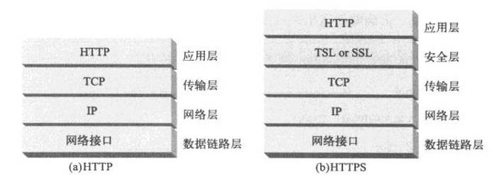
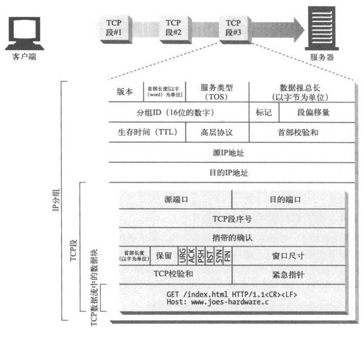
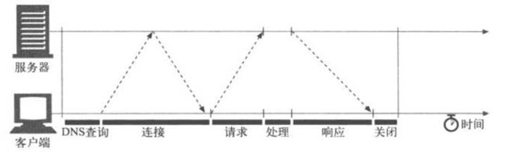
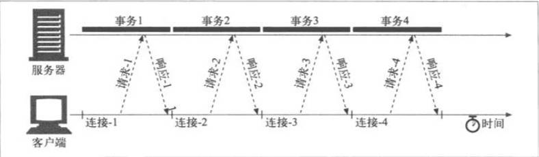
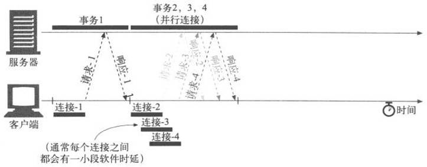
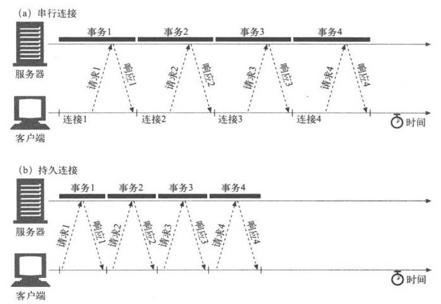
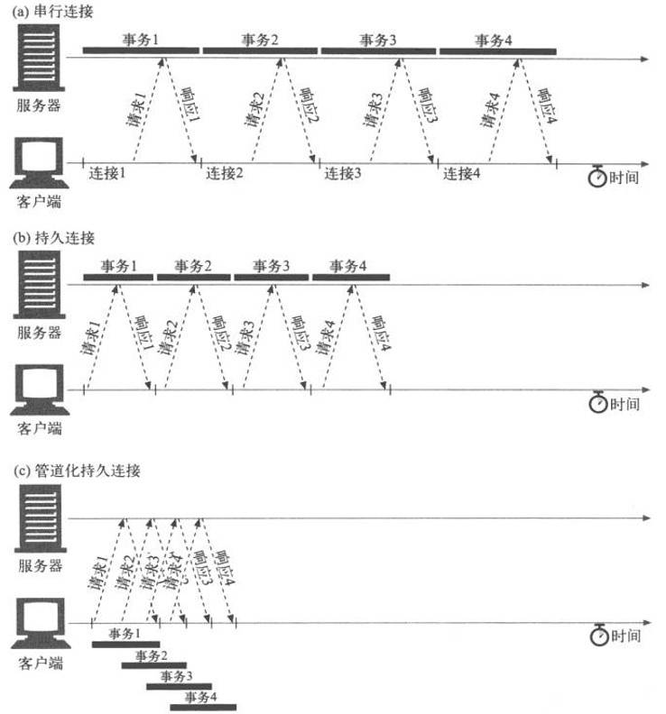

# HTTP 连接管理

世界上几乎所有的HTTP通信都是由TCP/IP承载的，TCP/IP是全球计算机及网络设备都在使用的一种常用的分组交换网络分层协议集。
客户端应用程序可以打开一条TCP/IP连接，连接到可能运行在世界任何地方的服务器应用程序.
HTTP 连接实际上就是TCP连接和一些使用连接的规则。

## 1 TCP概念
TCP为HTTP提供了一条可靠的比特传输管道。从TCP连接一端填入的字节会从另一端以原有的顺序、正确地传送出来 。
TCP的数据是通过名为IP分组(或IP数据报)的小数据块来发送的，其安全版本HTTPS就是在HTTP和TCP之间插入了一个(称为TSL或SSL的)密码加密层.

## 2 TCP性能
HTTP紧挨着TCP，位于其上层，所以HTTP事务性能很大程度上取决于底层TCP通道的性能。

## 3 HTTP事务时延

与建立TCP连接，以及传输请求和响应报文的时间相比，**事务处理时间可能是很短**的。除非客户端或服务器超载，或正在处理复杂的动态资源，否则HTTP时延就是由TCP网络时延构成的。
HTTP事务的时延有以下几种主要原因：
1. 客户端首先需要根据URI确定Web服务器的IP地址和端口号。如果最近没有对URI中的主机名进行访问，通过DNS解析系统将URI中的主机名转换成一个IP地址可能要花费数十秒的时间。
注意:大多数HTTP客户端都有一个小的DNS缓存，用来保存近期所访问站点的IP地址。如果已经在本地“缓存”(记录)了IP地址，査询就可以立即完成。
因为大多数Web浏览器浏览的都是少数常用站点，所以通常都可以很快地将主机名解析出来.
2. 客户端向服务器发送一条TCP连接请求，并等待服务器回送一个请求接受应答。每条新的TCP连接都会有连接建立时延。这个值通常最多只有一两秒钟，但如果有数百个HTTP事务，这个值会快速叠加上去。
3. 一旦连接建立起来了，客户端就会通过新建立的TCP管道来发送HTTP请求。数据到达时，Web服务器会从TCP连接中读取请求报文，并对请求进行处理。因特网传输请求报文，以及服务器处理请求报文都需要时间。
4. 然后，Web服务器会回送HTTP响应，这也需要花费时间。

这些TCP网络时延的大小取决于硬件速度、网络和服务器的负载，请求和响应报文的尺寸，以及客户端和服务器之间的距离。TCP协议的技术复杂性也会对时延产生巨大的影响。

## 4 TCP性能聚焦区域
- TCP 连接建立握手
- TCP 慢启动拥塞控制
- 数据聚集的Nagle算法
- 用于捎带确认的TCP延迟确认算法
- TIME_WAIT时延和端口耗尽

### 4.1 TCP 连接建立握手

TCP连接握手需要经过以下几个步骤：

1. 请求新的TCP连接时，客户端要向服务器发送一个小的TCP分组(通常是40-60个字节)。这个分组中设置了一个特殊的SYN标记，说明这是一个连接请求
2. 如果服务器接受了连接，就会对一些连接参数进行计算，并向客户端回送一个TCP分组，这个分组中的SYN和ACK标记都被置位，说明连接请求已被接受
3. 最后，客户端向服务器回送一条确认信息，通知它连接已成功建立。现代的TCP栈都允许客户端在这个确认分组中发送数据。

常HTTP事务都不会交换太多数据，此时，SYN/SYN+ACK握手会产生一个可测量的时延。
TCP连接的ACK分组通常都足够大，可以承载整个HTTP请求报文，而且很多HTTP服务器响应报文都可以放入一个IP分组中去。
最后的结果是，小的HTTP事务可能会在TCP建立上花费50%，或更多的时间。所以采取有效措施来减小这种TCP建立时延所造成的影响是有益的。

### 4.2 TCP 延迟确认
由于因特网自身无法确保可靠的分组传输(因特网路由器超负荷的话，可以随意丢弃分组)，所以**TCP实现了自己的确认机制**来确保数据的成功传输

每个TCP段都有一个序列号和数据完整性校验和。每个段的接收者收到完好的段时，都会向发送者回送小的确认分组。
如果发送者没有在指定的窗口时间内收到确认信息，发送者就认为分组已被破坏或损毁，并重发数据。
由于确认报文很小，所以**TCP允许在发往相同方向的输出数据分组中对确认报文进行“捎带”**。TCP将返回的确认信息与输出的数据分组结合在一起，可以更有效地利用网络。
为了增加确认报文找到同向传输数据分组的可能性，很多TCP栈都实现了一种“延迟确认”算法,
延迟确认算法会在一个特定的窗口时间(通常是100-200ms)内将输出确认存放在缓冲区中，以寻找能够梢带它的输出数据分组。
如果在那个时间段内**没有输出数据分组**，就**将确认信息放在单独的分组**中传送。
但是，HTTP具有双峰特征的请求——应答行为降低了捎带信息的可能。当希望有相反方向回传分组的时候，偏偏没有那么多。
通常，延迟确认算法会引入相当大的时延。根据所使用操作系统的不同，可以调整或禁止延迟确认算法。

### 4.3 TCP慢启动
TCP数据传输的性能还取决于TCP连接的使用期(age)。TCP连接会随着时间进行自我“调谐”，起初会限制连接的最大速度，
如果数据成功传输，会随着时间的推移提高传输的速度。这种调谐被称为TCP慢启动(slow start)，用于防止因特网的突然过载和拥塞.
TCP慢启动限制了一个TCP端点在任意时刻可以传输的分组数。简单来说，每成功接收一个分组，发送端就有了发送另外两个分组的权限。
如果某个HTTP事务有大量数据要发送，是不能一次将所有分组都发送出去的。
必须发送一个分组，等待确认，然后可以发送两个分组，每个分组都必须被确认，这样就可以发送四个分组了，以此类推。这种方式被称为“打开拥塞窗口”。

### 4.4 Nagle 算法

TCP有一个数据流接口，应用程序可以通过它将任意尺寸的数据放入TCP栈中——即使一次只放一个字节也可以。
但是，每个TCP段中都至少装载了40个字节的标记和首部，所以如果TCP发送了大量包含少量数据的分组，网络的性能就会严重下降。

Nagle算法(根据其发明者John Nagle命名)试图在发送一个分组之前，将大量TCP数据绑定在一起，以提高网络效率。
Nagle算法**鼓励发送全尺寸**(LAN上最大尺寸的分组大约是1500字节，在因特网上是几百字节)的段。
只有当所有其他分组都被确认之后，Nagle算法才允许发送非全尺寸的分组。如果其他分组仍然在传输过程中，就将那部分数据缓存起来。
只有当挂起分组被确认，或者缓存中积累了足够发送一个全尺寸分组的数据时，才会将缓存的数据发送出去。

Nagle算法会引发几种HTTP性能问题。首先，小的HTTP报文可能无法填满一个分组，可能会因为等待那些永远不会到来的额外数据而产生时延。
其次，Nagle算法与延迟确认之间的交互存在问题——Nagle算法会阻止数据的发送，直到有确认分组抵达为止，但确认分组自身会被延迟确认算法延迟100——200ms。
HTTP应用程序常常会在自己的栈中设置参数TCP_NODELAY，禁用Nagle算法，提髙性能。如果要这么做的话，一定要确保会向TCP写入大块的数据，这样就不会产生一堆小分组。

### 4.5 TIME_WAIT累积
TIME_WAIT端口耗尽是很严重的性能问题，会影响到性能基准，但在现实中相对较少出现。大多数遇到**性能基准问题**的人最终都会碰到这个问题，而且性能都会变得出乎意料地差。

当某个TCP端点关闭TCP连接时，会在内存中维护一个小的控制块，用来记录最近所关闭连接的IP地址和端口号。
这类信息只会维持一小段时间，通常是所估计的最大分段使用期的两倍(称为2MSL，通常为2分钟)左右，
以确保在这段时间内**不会创建具有相同地址和端口号的新连接**。实际上，这个算法可以防止在两分钟内创建、关闭并重新创建两个具有相同IP地址和端口号的连接。

用TIME_WAIT防止端口号重用时，这些情况也限制了可用的连接值组合。客户端每次连接到服务器上去时，都会获得一个新的源端口，以实现连接的唯一性。
但由于可用源端口的数量有限(比如，60000个)，而且在2MSL秒(比如，120秒)内连接是无法重用的，连接串就被限制在了60000/120=500次/秒。
如果再不断进行优化，并且服务器的连接率不高于500次/秒，就可确保不会遇到TIME_WAIT端口耗尽问题。
要修正这个问题，可以增加客户端负载生成机器的数量，或者确保客户端和服务器在循环使用几个虚拟IP地址以增加更多的连接组合
即使没有遇到端口耗尽问题，也要特别小心有大量连接处于打开状态的情况，或为处于等待状态的连接分配了大量控制块的情况。
在有大量打开连接或控制块的情况下，有些操作系统的速度会严重减缓。

## 5 串行连接

如果只对连接进行简单的管理，TCP的性能时延可能会叠加起来。比如，假设有一个包含了3个嵌入图片的Web页面。
浏览器需要发起4个HTTP事务来显示此页面：1个用于顶层的HTML页面，3个用于嵌入的图片。
如果每个事务都需要(串行地建立)一条新的连接，那么连接时延和慢启动时延就会叠加起来。

除了串行加载引入的实际时延之外，加载一幅图片时，页面上其他地方都没有动静也会让人觉得速度很慢。用户更希望能够同时加载多幅图片.
有几种现存和新兴的方法可以提髙HTTP的连接性能：
- 1、并行连接，通过多条TCP连接发起并发的HTTP请求；
- 2、持久连接，重用TCP连接，以消除连接及关闭时延；
- 3、管道化连接，通过共享的TCP连接发起并发的HTTP请求；
- 4、复用的连接，交替传送请求和响应报文(实验阶段)。

## 6 并行连接

HTTP允许客户端打开多条连接，并行地执行多个HTTP事务。下图中并行加载了四幅嵌入式图片，每个事务都有自己的TCP连接.
包含嵌入对象的组合页面如果能通过并行连接，克服单条连接的空载时间和带宽限制，加载速度也会有所提高。
**时延可以重叠**起来，而且如果单条连接没有充分利用客户端的网络带宽，可以将未用带宽分配来装载其他对象。

即使并行连接的速度可能会更快，但**并不一定总是更快**。客户端的网络带宽不足(比如，浏览器是通过一个28.8kbps的Modem连接到因特网上去的)时，大部分的时间可能都是用来传送数据的。
在这种情况下，一个连接到速度较快服务器上的HTTP事务就会很容易地耗尽所有可用的Modem带宽。
如果并行加载多个对象，每个对象都会去竞争这有限的带宽，每个对象都会以较慢的速度按比例加载，这样带来的性能提升就很小，甚至没什么提升。   .
实际上，多条连接会产生一些额外的开销，使用并行连接装载整个页面所需的时间很**可能比串行下载的时间更长**。
而且，打开大量连接会消耗很多内存资源，从而引发自身的性能问题。
复杂的Web页面可能会有数十或数百个内嵌对象。客户端可能可以打开数百个连接，但Web服务器通常要同时处理很多其他用户的请求，所以很少有Web服务器希望出现这样的情况。
一百个用户同时发出申请，每个用户打开100个连接，服务器就要负责处理10000个连接。这会造成服务器性能的严重下降。对高负荷的代理来说也同样如此。
实际上，**浏览器确实使用了并行连接**，但它们会将并行连接的总数限制为一个较小的值(通常是4个)。服务器可以随意关闭来自特定客户端的超量连接。

## 7 持久连接

站点局部性(site locality)： Web客户端经常会打开到同一个站点的连接。比如，一个Web页面上的大部分内嵌图片通常都来自同一个Web站点，而且相当一部分指向其他对象的超链接**通常都指向同一个站点**。
因此，初始化对某服务器HTTP请求的应用程序很可能会在不久的将来对那台服务器发起更多的请求(比如，获取在线图片)。这种性质被称为站点局部性(site locality).

HTTP/1.1(以及HTTP/1.0的各种增强版本)允许HTTP设备在事务处理结束之后将TCP连接保持在打开状态，以便为未来的HTTP请求重用现存的连接。
**在事务处理结束之后仍然保持在打开状态的TCP连接被称为持久连接**。
非持久连接会在每个事务结束之后关闭。持久连接会在不同事务之间保持打开状态，直到客户端或服务器决定将其关闭为止。

并行连接缺点：
- 1、每个事务都会打开/关闭一条新的连接，会耗费时间和带宽；
- 2、由于TCP慢启动特性的存在，每条新连接的性能都会有所降低；
- 3、可打开的并行连接数量实际上是有限的

持久连接优点：
- 1、重用已对目标服务器打开的空闲持久连接，就可以避开缓慢的连接建立阶段。
- 2、已经打开的连接还可以避免慢启动的拥塞适应阶段，以便更快速地进行数据的传输
总之，持久连接降低了时延和连接建立的开销，将连接保持在已调谐状态，而且减少了打开连接的潜在数量。
但是，管理持久连接时要特别小心，不然就会累积出大量的空闲连接，耗费本地以及远程客户端和服务器上的资源
持久连接与并行连接配合使用可能是最高效的方式。现在，很多Web应用程序都会打开少量的并行连接，其中的每一个都是持久连接。
持久连接有两种类型：比较老的HTTP/1.0+“keep-alive”连接，以及现代的HTTP/1.1“persistent”连接。

## 8 管道化连接
HTTP/1.1允许在持久连接上可选地使用请求管道。这是在keep-alive连接上的进一步性能优化。
**在响应到达之前，可以将多条请求放入队列**。当第一条请求通过网络流向服务器时，第二条和第三条请求也可以开始发送了。在髙时延网络条件下，这样做可以降低网络的环回时间，提高性能.
对管道化连接有如下几条限制：
- 如果HTTP客户端无法确认连接是持久的，就不应该使用管道;
- 必须按照与请求相同的顺序回送HTTP响应。HTTP报文中没有序列号标签，因此如果收到的响应失序了，就没办法将其与请求匹配起来了;
- HTTP客户端必须做好连接会在任意时刻关闭的准备，还要准备好重发所有未完成的管道化清求。如果客户端打开了一条持久连接，并立即发出了10条请求，服务器可能在只处理了5条请求之后关闭连接。
 剩下的5条请求会失败，客户端必须能够应对这些过早关闭连接的情况，重新发出这些请求.
- HTTP客户端不应该用管道化的方式发送会产生副作用的请求(比如POST)。
总之，出错的时候，管道化方式会阻碍客户端了解服务器执行的是一系列管道化请求中的哪一些。
 由于无法安全地重试POST这样的非幂等请求(幂等是指多个请求返回相同的结果)，所以出错时，就存在某些方法永远不会被执行的风险.

## 9 关闭连接
所有HTTP客户端、服务器或代理都**可以在任意时刻关闭一条TCP传输连接**。
**通常会在一条报文结束时关闭连接**，但出错的时候，也可能在首部行的中间，或其他奇怪的地方关闭连接。
对管道化持久连接来说，这种情形是很常见的。HTTP应用程序可以在经过任意一段时间之后，关闭持久连接。比如，在持久连接空闲一段时间之后，服务器可能会决定将其关闭。
但是，服务器**永远都无法确定在它关闭“空闲”连接的那一刻，在线路那一头的客户端有没有数据要发送**。如果出现这种情况，客户端就会在写入半截请求报文时发现出现了连接错误。

## 9.1 与关闭连接相关的概念

1. Content-Length

每条HTTP响应都应该有精确的Content-Length首部，用以描述响应主体的尺寸。
一些**老的HTTP服务器会省略**Content-Length首部，或者包含**错误的长度指示**，这样就要依赖服务器发出的连接关闭来说明数据的真实末尾。
客户端或代理收到一条随连接关闭而结束的HTTP响应，且**实际传输的实体长度与Content-Length并不匹配**(或没有Content-Length)时，接收端就应该质疑长度的正确性。
如果接收端是个缓存代理，接收端就不应该缓存这条响应，以降低今后将潜在的错误报文混合起来的可能。
代理应该将有问题的报文原封不动地转发出去，而不应该试图去“校正”Content-Length，以维护语义的透明性。

2. 幂等性
即使在非错误情况下，连接也可以在任意时刻关闭。**HTTP应用程序要做好正确处理非预期关闭的准备**。
如果在客户端执行事务的过程中，传输连接关闭了，那么，**除非事务处理会带来一些副作用，否则客户端就应该重新打开连接，并重试一次**.

非幂等性的的操作会带来副作用，客户端不应该以管道化方式传送非幂等请求(比如POST)。否则，传输连接的过早终止就会造成一些不确定的后果。
要发送一条非幂等请求，就需要等待来自前一条清求的响应状态（如果关闭了，则无法知道是否操作成功）。
尽管用户Agent代理可能会让操作员来选择是否对请求进行重试，但一定不能自动重试非幂等方法或序列。
比如，大多数浏览器都会在重载一个缓存的POST响应时提供一个对话框，询问用户是否希望再次发起事务处理。

3. 完全关闭与半关闭

应用程序可以关闭TCP输入和输出信道中的任意一个，或者将两者都关闭了。
套接字调用close()会将TCP连接的输入和输出信道都关闭了。这被称作“完全关闭”。
还可以用套接字调用shutdown()单独关闭输入或输出信道。这被称为“半关闭”。

**输出信道关闭**
关闭连接的**输出信道总是很安全**的。连接另一端的对等实体会在从其缓冲区中读出所有数据之后收到一条通知，说明流结束了，这样它就知道你将连接关闭了。

**输入信道关闭**
关闭连接的**输入信道比较危险**，除非你知道另一端不打算再发送其他数据了。
如果另一端向你已关闭的输入信道发送数据，操作系统就会向另一端的机器回送一条TCP“连接被对端重置”的报文。
大部分操作系统都会将这种情况作为很严重的错误来处理，删除对端还未读取的所有缓存数据。对管道化连接来说，这是非常糟糕的事情。
比如已经在一条持久连接上发送了10条管道式请求，响应也已经收到了，正在操作系统的缓冲区中存着，但应用程序还未将其读走。
现在，假设发送了第11条请求，但服务器认为使用这条连接的时间已经够长了，决定将其关闭。
那么第11条请求就会被发送到一条已关闭的连接上去，并会回送一条重置信息，这个重置信息会清空输入缓冲区。
当最终要去读取数据的时候，会得到一个连接被对端重置的错误，已缓存的未读响应数据都丢失了，尽管其中的大部分都已经成功抵达机器了。
 
4 、正常关闭
HTTP规范建议，当客户端或服务器突然要关闭一条连接时，应该“正常地关闭传输连接”，但它并没有说明应该如何去做。
总之，实现正常关闭的应用程序首先应该关闭它们的输出信道，然后等待连接另一端的对等实体关闭它的输出信道。
当两端都告诉对方它们不会再发送任何数据之后，连接就会被完全关闭，而不会重置的危险。
但不幸的是，无法确保对等实体会实现半关闭，或对其进行检査。
因此，想要正常关闭连接的应用程序应该**先半关闭其输出信道**，然后**周期性地检査其输入信道的状态**(查找数据，或流的末尾)。
如果在**一定的时间区间内对端没有关闭输入信道**，应用程序**可以强制关闭连接**，以节省资源。