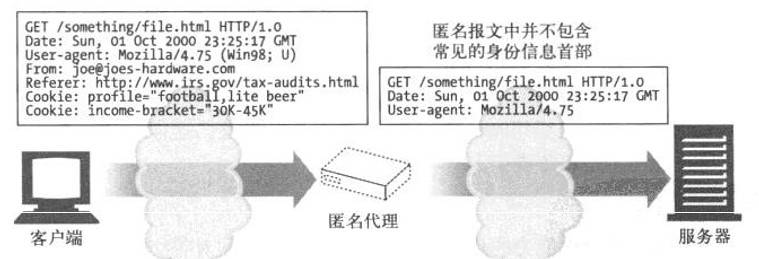

# 代理
Web代理(proxy)服务器是网络的中间实体，位于客户端和服务器之间，扮演“中间人”的角色，在各端点之间来回传送HTTP报文。

1. 私有代理
单个客户端专用的代理被称为私有代理。
专用的私有代理并不常见，但它们确实存在，尤其是直接运行在客户端计算机上的时候。
有些浏览器辅助产品，以及一些ISP服务，会在用户的PC上直接运行一些小型的代理，以便扩展浏览器特性，提髙性能，或为免费ISP服务提供主机广告。

2. 共享代理

众多客户端共享的代理被称为公共代理。
大多数代理都是公共的共享代理。集中式代理的成本效率更高，更容易管理。某些代理应用，比如高速缓存代理服务器，会利用用户间共同的请求，这样的话，汇入同一个代理服务器的用户越多，它就越有用。

严格来说，**代理连接的是两个或多个使用相同协议**的应用程序，而**网关连接的则是两个或多个使用不同协议**的端点。网关扮演的是“协议转换器”的角色。

## 1 为什么使用代理

代理服务器可以实现各种有用的功能。它们可以**改善安全性，提高性能，节省费用**。代理服务器可以看到并接触到所有流过的HTTP流量，所以代理**可以监视流量并对其进行修改**，
以实现很多有用的增值Web服务。

1. 儿童过滤器
小学在为教育站点提供无阻碍访问的同时，可以利用过滤器代理来阻止学生访问成人内容。代理应该允许学生无限制地访问教育性内容，但对不适合儿童的站点要强行禁止访问。


2. 文档访问控制
可以用代理服务器在大量Web服务器和Web资源之间实现统一的访问控制策略，创建审核跟踪机制。这在大型企业环境或其他分布式机构中是很有用的.
在集中式代理服务器上可以对所有访问控制功能进行配置，而无需在众多由不同组织管理、不同厂商制造、使用不同模式的Web服务器上进行经常性的访问控制升级.
在下图中，集中式访问控制代理：允许客户端1无限制地访问服务器A的新闻页面；客户端2可以无限制地访问因特网；在允许客户端3访问服务器B之前，要求其输入口令.


3. 安全防火墙
网络安全工程师通常会使用代理服务器来提高安全性。代理服务器会在网络中的单一安全节点上限制哪些应用层协议的数据可以流入或流出一个组织。
还可以提供用来消除病毒的Web和E-mail代理使用的那种挂钩程序，以便对流量进行详细的检査.


4. Web缓存
代理缓存维护了常用文档的本地副本，并将它们按需提供，以减少缓慢且昂贵的因特网通信。
在下图中，客户端1和客户端2会去访问附近Web缓存上的对象A，而客户端3和客户端4访问的则是原始服务器上的文档.


5. 反向代理
代理可以假扮Web服务器，这些被称为替代物(surrogate)或反向代理(reverse proxy)的代理接收发给Web服务器的真实请求，
但与Web服务器不同的是，它们可以发起与其他服务器的通信，以便按需定位所请求的内容。
反向代理可以提高访问慢速Web服务器上公共内容时的性能。在这种配置中，通常将这些反向代理称为服务器加速器(server accelerator)。
还可以将替代物与内容路由功能配合使用，以创建按需复制内容的分布式网络。


6. 内容路由器
代理服务器可以作为“内容路由器”使用，根据因特网流量状况以及内容类型将请求导向特定的Web服务器。
内容路由器也可以用来实现各种服务级的请求。比如，如果用户或内容提供者付费要求提供更髙的性能，内容路由器可以将请求转发到附近的复制缓存，
或者如果用户申请了过滤服务，还可以通过过滤代理来转发HTTP请求。


7. 转码器
代理服务器在将内容发送给客户端之前，可以修改内容的主体格式。在这些数据表示法之间进行的透明转换被称为转码(transcoding)。
转码代理可以在传输GIF图片时，将其转换成JPEG图片，以减小尺寸。也可以对图片进行压缩，或降低颜色的色彩饱和度以便在电视上观看。
同样，可以对文本文件进行压缩，并为能够使用因特网智能手机生成小型的文本摘要Web页面。代理甚至可以在传输文档的过程中将其转换成外语。


8. 匿名者

匿名者代理会主动从HTTP报文中删除身份特性(比如客户端IP地址、From首部、Referer首部、cookie、URI的会话ID)，从而提供高度的私密性和匿名性.




## 2 代理的层次结构

可以通过代理层次结构(proxy hierarchy)将代理级联起来。在代理的层次结构中，会将报文从一个代理传给另一个代理，直到最终抵达原始服务器为止，然后通过代理传回给客户端.
Proxy层次结构中的代理服务器被赋予了父(parent)和子(child)的关系。下一个入口(inbound)代理(**靠近服务器)被称为父代理**，下一个出口(outbound)代理(靠近客户端)被称为子代理.
下图中，代理1是代理2的子代理。同样，代理2是代理3的子代理，代理3是代理2的父代理.


层次不一定非得是静态的。代理服务器可以根据众多因素，将报文转发给一个**不断变化的代理服务器和原始服务器集***.
如，在下图中，访问代理会根据不同的情况将报文转发给父代理或原始服务器：
- 如果所请求的对象属于一个付费使用内容分发服务的Web服务器，代理就会将请求发送给附近的一个缓存服务器，这个服务器会返回已缓存对象，或者如果它那儿没有的话，它会去取回内容；
- 如果请求的是特定类型的图片，访问代理会将请求转发给一个特定的压缩代理，这个代理会去获取图片，然后对其进行压缩，这样通过到客户端的慢速Modem下载时，速度会更快一些.


动态选择父代理的例子:
- a、负载均衡
子代理可能会根据当前父代理上的工作负载级别来决定如何选择一个父代理，以均衡负载。

- b、地理位置附近的路由
子代理可能会选择负责原始服务器所在物理区域的父代理。

- c、协议/类型路由
子代理可能会根据URI将报文转发到不同的父代理和原始服务器上去。某些特定类型的URI可能要通过一些特殊的代理服务器转发请求，以便进行特殊的协议处理。

- d、基于订购的路由
如果发布者为高性能服务额外付费了，它们的UR1就会被转发到大型缓存或压缩引擎上去，以提高性能。

## 3 代理如何获取流量

有四种常见方式可以使客户端流量流向代理：
- a、修改客户端
很多Web客户端都支持手工和自动的代理配置。如果将客户端配置为使用代理服务器，客户端就会将HTTP请求有意地直接发送给代理，而不是原始服务器。

- b、修改网络
网络基础设施可以通过若干种技术手段，在客户端不知道或没有参与的情况下，拦截网络流量并将其导入代理。
这种拦截通常都依赖于监视HTTP流量的交换设备及路由设备，在客户端毫不知情的情况下，对其进行拦截，并将流量导入一个代理。这种代理被称为拦截(intercepting)代理。
拦截代理通常被称为“透明代理”，因为会在不知情的情况下连接到这些代理上去。但HTTP规范中已用“透明”来表示那些不会对语义进行修改的功能了，所以标准制定机构建议在流量捕获中使用术语“拦截”。

- c、修改DNS的命名空间
放在Web服务器之前的代理服务器——替代物，会直接假扮Web服务器的名字和IP地址，这样，所有的请求就会发送给这些替代物，而不是服务器。
要实现这一点，可以手工编辑DNS名称列表，或者用特殊的动态DNS服务器根据需要来确定适当的代理或服务器。
有时在安装过程中，真实服务器的IP地址和名称被修改了，替代物得到的会是之前的地址和名称。

- d、修改Web服务器
可以将某些Web服务器配置为向客户端发送一条HTTP重定向命令(响应码 305)，将客户端请求重定向到一个代理上去。收到重定向命令后，客户端会与代理进行通信。


## 3.1 客户端设置

1. 手工设置
很多Web客户端都允许用户手工配置代理。浏览器为代理配置提供了便捷的支持，为代理指定主机和端口。
有些ISP会向客户发送预先配置好的浏览器，或定制好的操作系统，使其将Web流量重定向到代理服务器上。
手工代理配置很简单但有些死板。只能为所有内容指定唯一的一个代理服务器，而且不支持故障转移。
手工代理配置还会给大型组织带来管理问题。如果配置过的浏览器基数很大，那么需要进行修改的时候，重新配置每个浏览器是非常困难，甚至是不可能的。

2. 客户端代理配置PAC文件
PAC： 代理的自动配置(Proxy Auto-Configuration, PAC)。
PAC文件是一些小型的JavaScript程序，可以在运行过程中计算代理设置。因此，是一种更动态的代理配置解决方案。访问每个文档时，JavaScript函数都会选择恰当的代理服务器
要使用PAC文件，就要用JavaScript PAC文件的URI来配置浏览器，配置方式与手工配置类似，但要在“automatic configuration”(自动配置)框中提供一个URI。
浏览器会从这个URI上获取PAC文件，并用JavaScript逻辑为每次访问计算恰当的代理服务器。PAC文件的后缀通常是.pac，MIME类型通常是application/x-ns-proxy-autoconfig
每个PAC文件都必须定义一个名为FindProxyForURL(url,host)的函数，用来计算访问URI时使用的适当的代理服务器。函数的返回值可以是下表中列出的任意值：

```
FindProxyForURL的返回值              描述
DIRECT                             不经过任何代理，直接进行连接
PROXY host: port                   应该使用指定的代理
SOCKS host:port                    应该使用指定的SOCKS服务器
```
3. 客户端代理配置 WPAD
有些浏览器支持Web代理自动发现协议(Web Proxy Autodiscovery Protocol, WPAD)，这个协议会自动检测出浏览器可以从哪个“配置服务器”下载到一个自动配置文件.
WPAD协议的算法会使用发现机制的逐级上升策略自动地为浏览器査找合适的PAC文件。实现WPAD协议的客户端需要：
- 1. 用WPAD找到PAC的URI；
- 2. 从指定的URI获取PAC文件；
- 3. 执行PAC文件来判定代理服务器；
- 4. 为请求使用代理服务器
WPAD会使用一系列的资源发现技术来判定适当的PAC文件。并不是所有组织都能够使用所有的发现技术，所以WPAD使用了很多种发现技术。
WPAD会一个接一个地对每种技术进行尝试，直到成功为止;

　
## 4 与代理有关的棘手问题

### 4.1 代理URI和服务器URI不同

客户端向Web服务器发送请求时，请求行中只包含部分URI(没有方案、主机或端口)，例如：

```
GET /index.html HTTP/1.0
User-Agent: SuperBrowser v1.3
```

但当客户端向代理发送请求时，请求行中则包含完整的URI，例如：

```
GET http://www.marys-antiques.com/index.html HTTP/1.0
User-Agent: SuperBrowser v1.3
```

在原始的HTTP设计中，客户端会直接与单个服务器进行对话。不存在虚拟主机，也没有为代理制定什么规则。
单个的服务器都知道自己的主机名和端口，所以，**为了避免发送冗余信息，客户端只需发送部分URI即可**，无需发送方案和主机以及端口。
代理出现之后，使用部分URI就有问题了。代理需要知道目标服务器的名称，这样它们才能建立自己与服务器的连接。
基于代理的网关要知道URI的方案才能连接到FTP资源和其他方案上去。
HTTP/1.0要求代理请求发送完整的URI，解决了这个问题，但它为服务器请求保留部分URI的形式(已经有相当多的服务器都改为支持完整URI了)。
现在，HTTP/1.1要求服务器为代理请求和服务器请求都提供完整的URI处理，但实际上，很多已部署的服务器仍然只接受部分URL，因此，要将部分URI发送给服务器，将完整URI发。


### 4.2 与虚拟主机一样的问题

代理“缺少方案/主机/端口”的问题与虚拟主机Web服务器面临的问题相同。
虚拟主机Web服务器会在**很多Web站点间共享同一个物理Web服务器**。包含部分URI(比如/index.html)的请求到达时，虚拟主机Web服务器需要知道目的Web站点的主机名.
- 显式的代理要求在请求报文中使用完整URI来解决这个问题；
- 虚拟主机Web服务器要求使用Host首部来承载主机和端口信息

### 4.3 拦截代理会收到部分URI

只要客户端正确地实现了HTTP，它们就会在请求中包含完整的URI，发送给经过显式配置的代理。
这样解决了部分问题，但还有一个问题：
a)  客户端并不总是知道它是在和代理进行对话，因为有些代理对客户端可能是不可见的。
b) 即使没有将客户端配置为使用代理，客户端的流量也可能会经过**替代物或拦截代理**。
在这两种情况下，客户端都会认为它在与Web服务器进行对话，不会发送完整的URI。

替代物： 反向代理是一个用来取代原始服务器的代理服务器，它通常会通过假扮服务器的主机名或IP地址来做到这一点。
它会收到Web服务器请求，可能会向真正的服务器提供缓存的响应或者代理请求。客户端无法区分反向代理和Web 服务器，因此它会发送部分URI。
拦截代理： 是网络流量中的代理服务器，它会拦截从客户端发往服务器的请求，并提供一个缓存响应，或对其进行转发。


### 4.4 转发过程中对URI修改

代理服务器要在转发报文时修改请求URI的话，需要恃别小心。**对URI的微小修改，甚至是看起来无害的修改，都可能给下游服务器带来一些互操作性**问题。
有些看起来无害的转换行为，比如用显式的“:80”来取代默认的HTTP端口，或者用适当的换码转义符来取代非法的保留字符以校正URI，就可能造成互操作性问题。
总之，**代理服务器要尽量宽容**一些。它们的目标不是成为强制实现严格协议一致性的“协议警察”，因为这样可能会严重破坏之前能正常工作的服务。
特别是，HTTP规范禁止一般的拦截代理在转发URI时重写其绝对路径部分。唯一的例外是可以用“/”来取代空路径。

### 4.5 URI的客户端自动扩展和主机名解析

根据是否有代理，浏览器对请求URI的解析会有所不同。没有代理时，浏览器会获取输入的URI，尝试着寻找相应的IP地址。如果找到了主机名，浏览器会尝试相应的IP地址直到获得成功的连接为止。
但是，如果没有找到主机，很多浏览器都会尝试着提供某种主机名自动“扩展”机制，以防用户输入的是主机“简短”的缩写形式：
- 1、很多浏览器会尝试着加入前缀www.和后缀.com，以防用户只输入了常见Web站点名的中间部分(比如，人们可以输入yahoo而不是www.yahoo.com)；
- 2、有些浏览器甚至会将未解析出来的URI传递给第三方站点，这个站点会尝试着校正拼写错误，并给出一些用户可能希望访问的URI建议；
- 3、而且，大多数系统中的DNS配置允许用户只输入主机名的前缀，然后DNS会自动搜索域名。如果用户位于域名oreilly.com的范围之内，并输入了主机名host7，DNS会自动尝试将其与host7.oreilly.com进行匹配。

### 4.6 没有代理时URI的解析
没有代理时URI的解析示例如下：


### 4.7 有代理时URI的解析

使用显式代理时，用户的URI会被直接发送给代理，所以浏览器就不再执行所有这些便捷的扩展功能了.
有显式代理时，浏览器没有对不完整的主机名进行自动扩展。因此，当用户在浏览器的地址窗口中输入oreilly时，发送给代理的就是http://oreilly/.


### 4.8 有拦截代理时URI的解析

使用不可见的拦截代理时，对主机名的解析会略有不同，因为对客户端来说，是没有代理的。这种情况下的行为与使用服务器的情形很类似，浏览器会自动扩展主机名，直到DNS成功为止。


## 5 追踪报文

ISP(Internet Service Provider)，互联网服务提供商，即向广大用户综合提供互联网接入业务、信息业务和增值业务的电信运营商。
出于安全和节省费用的考虑，很多公司都会用缓存代理服务器来访问因特网，而且很多大型ISP都会使用代理缓存来提高性能并实现各种特性。现在，有相当比例的Web请求都是通过代理转发的。

## 5.1 Via 首部

Via首部字段列出了与报文途经的每个中间节点(代理或网关)有关的信息。报文每经过一个节点，都必须将这个中间节点添加到Via列表的末尾.
下面的Via字符串告诉我们报文流经了两个代理。这个字符串说明第一个代理名为proxy-62.irenes-isp.net，它实现了HTTP/1.1协议，第二个代理被称为cache.joes-hardware.com，实现了HTTP/1.0。
Via: 1.1 proxy-62.irenes-isp.net, 1.0 cache.joes-hardware.com

1.  Via 首部与网关

有些**代理会为使用非HTTP协议的服务器提供网关**的功能。via首部记录了这些协议转换。这样，HTTP应用程序就会了解代理链上各点的协议处理能力以及所做的协议转换了。
下图中，客户端向网关proxy.irenes-isp.net发送了一条对ftp://http-guide.com/pub/welcome.tst的HTTP请求。
作为协议网关使用的代理会用FTP协议从FTP服务器获取预期的对象。然后代理会用下面这个Via首部字段，在一条HTTP响应中将对象回送到客户端上去。
Via: FTP/1.0 proxy.irenes-isp.net(Traffic'Server/5.0.1-17882[cMs f ])


2.  Via 首部与Server

Server响应首部字段对原始服务器使用的软件进行了描述，下面是几个例子 :
Server: Apache/1.3.14 (Unix) PHP/4.0.4
Server: Microsoft-IIS/5.0 
如果响应报文是通过代理转发的，一定要确保**代理没有修改Server首部**。Server首部是用于原始服务器的，代理应该添加的是Via条目

3.  Via 首部与隐私安全

有时候，我们并**不希望在Via字符串中使用确切的主机名**。除非显式地允许了这种行为，否则，当代理服务器作为网络防火墙的一部分使用时，
是不应该转发防火墙后面那些主机的名字和端口号的，因为防火墙后面的网络结构信息可能会被恶意群体利用。
如果不允许进行Via节点名转发，作为安全防线的一部分使用的代理就应该用适当的假名来取代那台主机的名字。
一般来说，即使隐藏了真实名称，代理也应该尝试着为每台代理服务器保留一个Via路标条目
对那些有着非常强烈的隐私要求，需要隐藏内部网络设计和拓扑结构的组织来说，代理应该**将一个(接收协议值相同的)有序Via路标条目序列合并成**一个联合条目。比如，可以将：
Via: 1.0 foo, 1.1 devirus.company.com, 1.1 access -logger.company.com
压缩成：
Via: 1.0 foo, 1.1 concealed-stuff


## 5.2 TRACE方法
代理服务器可以在转发报文时对其进行修改。可以添加、修改或删除首部，也可以将主体部分转换成不同的格式。代理变得越来越复杂，开发代理产品的厂商也越来越多，互操作性问题也开始逐渐显现。
为了便于对代理网络进行诊断，我们需要有一种便捷的方式来观察在通过HTTP代理网络逐跳转发报文的过程中。
通过HTTP/1.1的**TRACE方法**，用户可以跟踪经代理链传输的请求报文，观察报文经过了哪些代理，以及每个代理是如何对请求报文进行修改的。TRACE对代理流的调试非常有用。


## 5.3 Max-Forwards

不管中间插入了多少代理，TRACE报文都会沿着整条路径传到目的服务器。可以使用Max-Forwards(最大转发次数)首部来限制TRACE和OPTIONS请求所经过的代理跳数.
Max-Forwards请求首部字段包含了一个整数，用来说明这条请求报文还可以被转发的次数。
如果Max-Forwards的值为零(Max-Forwards:0)，那么即使接收者不是原始服务器，它也必须将TRACE报文回送给客户端，而不应该继续转发.
如果收到的Max-Forwards值大于零，转发的报文中就必须包含一个更新的Max-Forwards字段，其值被减一。所有的代理和网关都应该支持Max-Forwards。


# 6 代理认证

代理可以作为访问控制设备使用。HTTP定义了一种名为代理认证(proxy authentication)的机制，这种机制可以阻止对内容的请求，直到用户向代理提供了有效的访问权限证书为止。
对受限内容的请求到达一台代理服务器时，
- 1、代理服务器可以返回一个要求使用访问证书的407 Proxy Authorization Required状态码，以及一个用于描述怎样提供这些证书的**Proxy-Authenticate**首部字段；
- 2、客户端收到407响应时，会尝试着从本地数据库中，或者通过提示用户来搜集所需要的证书；
- 3、只要获得了证书，客户端就会重新发送请求，在**Proxy-Authorization**首部 字段中提供所要求的证书；
- 4、如果证书有效，代理就会将原始请求沿着传输链路向下传送。否则，就发送另一条407应答。
若传输链路中有多个代理，且每个代理都要进行认证时，代理认证通常无法很好地工作。


# 7 代理互操作性

客户端、服务器和代理是由不同厂商构建的，实现的是不同版本的HTTP规范。
它们支持的特性各不相同，也存在着不同的问题。
代理服务器位于客户端和服务器设备之间，这些设备实现的协议可能有所不同，可能存在着很棘手的问题。

## 7.1 处理代理不支持的首部和方法

代理服务器可能无法理解所有经其传输的首部字段。有些首部可能比代理自身还要新；其他首部可能是特定应用程序独有的定制首部。
**代理必须对不认识的首部字段进行转发**，而且必须维持同名首部字段的相对顺序。
类似地，如果代理不熟悉某个方法，那么只要可能，就应该尝试着将报文转发到下一跳节点上去。

## 7.2 OPTIONS方法
通过使用OPTIONS，客户端可以在与服务器进行交互之前，确定服务器的能力，这样它就可以更方便地与具备不同特性的代理和服务器进行互操作。

如果OPTIONS请求的URI是个**星号(*)，请求的就是整个服务器**所支持的功能。比如：
OPTIONS * HTTP/1.1

如果URI是个**实际资源地址**，OPTIONS请求就是在査询那个**特定资源的可用特性**：
OPTIONS http://www.joes-hardware.com/index.html HTTP/1.1

OPTIONS方法就会返回一个包含了各种首部字段的200 OK响应，这些字段描述了服务器所支持的，或资源可用的各种可选特性。
HTTP/1.1在**响应中唯一指定的首部字段是Allow首部**，这个首部用于描述服务器所支持的各种方法(或者服务器上的特定资源)。

Allow实体首部字段列出了请求URI标识的资源所支持的方法列表，如果请求URI为*的话，列出的就是整个服务器所支持的方法列表。例如：
Allow: GET, HEAD, PUT


##  网络资源   
（https://blog.csdn.net/zt15732625878/article/details/78941268）     

### 正向代理
正向代理（forward proxy） ，一个位于客户端和原始服务器之间的服务器，为了从原始服务器取得内容，
客户端向代理发送一个请求并制定目标（原始服务器），然后代理向原始服务器转发请求并将获得的内容返回给客户端，
客户端才能使用正向代理。我们平时说的代理就是指正向代理。 
 


### 反向代理
反向代理（Reverse Proxy），以代理服务器来接受internet上的连接请求，然后将请求转发给内部网络上的服务器，           
并将从服务器上得到的结果返回给internet上请求的客户端，此时代理服务器对外表现为一个反向代理服务器。  


**正向代理和反向代理的区别**: 
1. 位置不同 
- 正向代理，架设在客户机和目标主机之间； 
- 反向代理，架设在服务器端；

2. 代理对象不同 
- 正向代理，代理客户端，服务端不知道实际发起请求的客户端； 
- 反向代理，代理服务端，客户端不知道实际提供服务的服务端； 


3. 用途不同 
- 正向代理，为在防火墙内的局域网客户端提供访问Internet的途径； 
- 反向代理，将防火墙后面的服务器提供给Internet访问；

4. 安全性不同 
- 正向代理允许客户端通过它访问任意网站并且隐藏客户端自身，因此必须采取安全措施以确保仅为授权的客户端提供服务； 
- 反向代理都对外都是透明的，访问者并不知道自己访问的是哪一个代理。


### 正向代理的应用
- 1. 访问原来无法访问的资源 
- 2. 用作缓存，加速访问速度 
- 3. 对客户端访问授权，上网进行认证 
- 4. 代理可以记录用户访问记录（上网行为管理），对外隐藏用户信息

### 反向代理的应用
- 1. 保护内网安全 
- 2. 负载均衡 
- 3. 缓存，减少服务器的压力   
Nginx作为最近较火的反向代理服务器，安装在目的主机端，主要用于转发客户机请求，后台有多个http服务器提供服务，        
nginx的功能就是把请求转发给后台的服务器，决定哪台目标主机来处理当前请求。        
 


