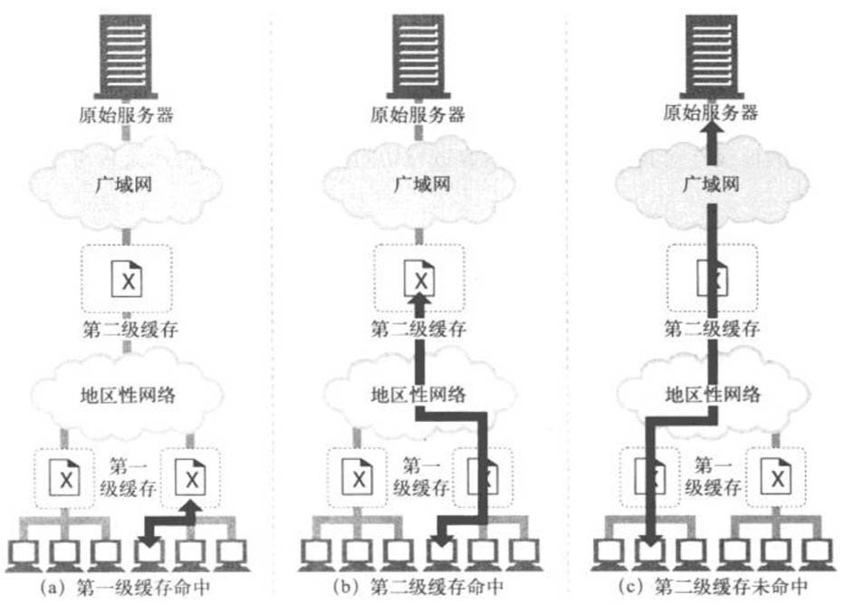
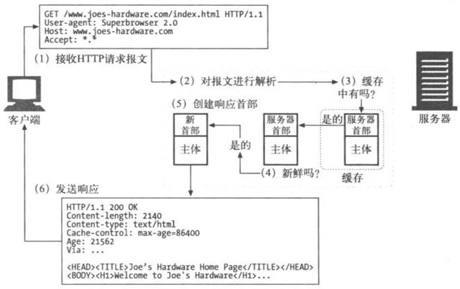
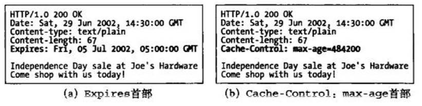

# 缓存
Web缓存是可以自动保存常见文档副本的HTTP设备。

## 1 缓存概念

### 1.1 缓存作用

1. 缓存减少了冗余的数据传输，节省了网络费用；
2. 缓解了网络瓶颈的问题，不需要更多的带宽就能够更快地加载页面；
3. 降低了对原始服务器的要求，服务器可以更快地响应，避免过载的出现；
4. 降低了距离时延，因为从较远的地方加载页面会更慢一些。

### 1.2 缓存必要性

1. 冗余的数据传输

多个客户端访问一个流行的原始服务器页面时，服务器会多次传输同一份文档，每次传送给一个客户端。一些相同的字节会在网络中一遍遍地传输。    
这些冗余的数据传输会耗尽昂贵的网络带宽，降低传输速度，加重Web服务器的负载。    
有了缓存，就可以保留第一条服务器响应的副本，后继请求就可以由缓存的副本来应对了，这样可以减少那些流入/流出原始服务器的，被浪费掉了的重复流量。    

2. 带宽瓶颈 
缓存还可以缓解网络的瓶颈问题。很多网络为本地网络客户端提供的带宽比为远程服务器提供的带宽要宽。客户端会以路径上最慢的网速访问服务器。     
如果客户端从一个快速局域网的缓存中得到了一份副本，那么缓存就可以提高性能——尤其是要传输比较大的文件时。    

3. 瞬间拥塞 
缓存在破坏瞬间拥塞(Flash Crowds)时显得非常重要。突发事件(比如爆炸性新闻、批量E-mail公告，或者某个名人事件)使很多人几乎同时去访问一个Web文档时，就会出现瞬间拥塞。造成网络和Web服务器产生灾难性的崩溃。        

4. 距离时延 
每台网络路由器都会增加因特网流量的时延。即使客户端和服务器之间没有太多的路由器，光速自身也会造成显著的时延。    

 
### 1.3 缓存命中
缓存**无法保存世界上每份文档的副本**。
可以用已有的副本为某些到达缓存的请求提供服务，这被称为缓存命中(cache hit)。   
其他一些到达缓存的请求可能会由于没有副本可用，而被转发给原始服务器。这被称为缓存未命中(cache miss)。  

### 1.4 缓存再验证
缓存可以在**任意时刻**，以**任意频率**对副本进行**再验证**。
但由于缓存通常会包含数百万的文档，而且网络带宽是很珍贵的，所以大部分缓存只有**在客户端发起请求**，并且**副本旧得足以需要检测**的时候，才会对副本进行再验证。

### 1.4.1 缓存再验证过程
缓存对缓存的副本进行再验证时，会向原始服务器发送一个小的再验证请求。如果内容没有变化，服务器会以一个小的304 Not Modified进行响应。        
只要缓存知道副本仍然有效，就会再次将副本标识为暂时新鲜的，并将副本提供给客户端，这被称作再验证命中(revalidate hit)或缓慢命中(slow hit)。        
这种方式确实要与原始服务器进行核对，所以会比单纯的缓存命中要慢，但它没有从服务器中获取对象数据，所以要比缓存未命中快一些。         
 

### 1.4.2 缓存再验证方法
HTTP提供了几个用来对已缓存对象进行再验证的工具，但**最常用的是If-Modified-Since首部**。  
将这个首部添加到GET请求中去，就可以告诉服务器，只有在**缓存了对象的副本**之后，**又对其进行了修改**的情况下，才发送此对象。
 
服务器收到GET If-Modified-Since请求时会发生的情况：   
- 再验证命中——如果服务器对象未被修改，服务器会向客户端发送一个小的HTTP **304 Not Modified响应**；
- 再验证未命中——如果服务器对象与已缓存副本不同，服务器向客户端发送一条普通的、带有完整内容的HTTP **200 0K响应**；
- 对象被删除——如果服务器对象已经被删除了，服务器就回送一个**404 Not Found响应**，缓存也会将其副本删除

### 1.5 命中率
由缓存提供服务的请求所占的比例被称为缓存命中率(cache hit rate,或称为缓存命中比例)，有时也被称为文档命中率(document hit rate)。命中率在0到1之间，但通常是用百分数来描述的。

命中率很难预测，但对现在中等规模的Web缓存来说，40%的命中率是很合理的。

1. 字节命中率
由于文档并不全是同一尺寸的，所以文档命中率并不能说明一切。
有些大型对象被访问的次数可能较少，但由于尺寸的原因，对整个数据流量的贡献却更大。因此，有些人更愿意使用字节命中率(byte hit rate)作为度量值(尤其那些按流量字节付费的人)。

2. 区分命中和未命中

不幸的是，**HTTP没有**为用户提供一种手段来区分响应是缓存命中的，还是访问原始服务器得到的。
在这两种情况下，响应码都是200 OK，说明响应有主体部分。
有些商业代理缓存会在Via首部附加一些额外信息，以描述缓存中发生的情况。
客户端有一种方法可以判断响应是否来自缓存，就是使用Date首部(报文创建的日期和时间)。将响应中Date首部的值与当前时间进行比较，如果响应中的日期值比较早，客户端通常就可以认为这是一条缓存的响应。
客户端也可以通过Age首部（响应首部,表示代理服务器当前的系统时间与此应答消息中的通用消息头 Date 的值之差）来检测缓存的响应，通过这个首部可以分辨出这条响应的使用期.
(Age消息头的值通常接近于0。表示此消息对象刚刚从原始服务器获取不久。否则，其值则是表示代理服务器当前的系统时间与此应答消息中的通用消息头 Date 的值之差。)

## 2 缓存的拓扑结构
缓存可以是单个用户专用的，也可以是数千名用户共享的。专用缓存被称为私有缓存(private cache)。 
1. 私有缓存是个人的缓存，包含了单个用户最常用的页面。
2. 共享的缓存被称为公有缓存(public cache)。公有缓存中包含了某个用户团体的常用页面。

### 2.1 私有缓存 
私有缓存不需要很大的动力或存储空间，这样就可以将其做的很小，很便宜。
Web浏览器中有内建的私有缓存——大多数浏览器都会将常用文档缓存在个人电脑的磁盘和内存中，并且允许用户去配置缓存的大小和各种设置。
还可以去看看浏览器的缓存中有些什么内容。

### 2.2 公有代理缓存 
公有缓存是特殊的共享代理服务器，被称为**缓存代理服务器(caching proxy server)**，或者更常见地被称为 **代理缓存(proxy cache)**。
代理缓存会从本地缓存中提供文档，或者代表用户与服务器进行联系。公有缓存会接受来自多个用户的访问，所以通过它可以更好地减少冗余流量。   

### 2.3 代理缓存的层次结构

在实际中，实现层次化(hierarchy)的缓存是很有意义的，在这种结构中，在较小缓存中未命中的请求会被导向较大的父缓存(parent cache)，            
由它来为剩下的那些“提炼过的”流量提供服务。下图显示了一个两级的缓存层次结构。其基本思想是在靠近客户端的地方使用小型廉价缓存，    
而更高层次中，则逐步采用更大、功能更强的缓存来装载多用户共享的文档。  

在缓存层次结构很深的情况下，请求可能要穿过很长一溜缓存，但每个拦截代理都会添加一些性能损耗，当代理链路变得很长的时候，这种性能损耗会变得非常明显.   

### 2.4 网状缓存/内容路由以及对等缓存

有些网络结构会构建**复杂的网状缓存(cache mesh)**，而不是简单的缓存层次结构。
网状缓存中的代理缓存之间会以更加复杂的方式进行对话，做出**动态的缓存通信决策**，决定与**哪个父缓存**进行对话，或者决定**彻底绕开**缓存，直接**连接原始服务器**。   
这种代理缓存会决定选择何种路由对内容进行访问、管理和传送，因此可将其称为内容路由器(content router)。    

缓存之间这些更为复杂的关系允许不同的组织互为对等(peer)实体，将它们的缓存连接起来以实现共贏。              
提供可选的对等支持的缓存被称为兄弟缓存(sibling cache)。HTTP并不支持兄弟缓存，所以人们通过一些协议对HTTP进行了扩展，               
比如因特网缓存协议(Internet Cache Protocol, ICP)和超文本缓存协议(HyperText Caching Protocol, HTCP)。 

## 3 缓存的处理步骤

缓存处理过程包括以下7个步骤：

- 1、接收——缓存从网络中读取抵达的请求报文

- 2、解析——缓存对报文进行解析，提取出URL和各种首部

- 3、査询——缓存査看是否有本地副本可用，如果没有，就获取一份副本，并将其保存在本地

- 4、新鲜度检测——缓存査看已缓存副本是否足够新鲜，如果不是，就询问服务器是否有任何更新

- 5、创建响应——缓存会用新的首部和已缓存的主体来构建一条响应报文

- 6、发送——缓存通过网络将响应发回给客户端

- 7、日志——缓存可选地创建一个日志文件条目来描述这个事务

新鲜度检测:      
HTTP通过缓存将服务器文档的副本保留一段时间。在这段时间里，都认为文档是“新鲜的”，缓存可以在不联系服务器的情况下，直接提供该文档。 
但一旦已缓存副本停留的时间太长，超过了文档的新鲜度限值(freshness limit)，就认为对象“过时”了，                 
在提供该文档之前，缓存要再次与服务器进行确认，以査看文档是否发生了变化。                 
客户端发送给缓存的所有请求首部自身都可以强制缓存进行再验证，或者完全避免验证，这使得事情变得更加复杂了.           
          
创建响应:

我们希望缓存的响应看起来就像来自原始服务器的一样，缓存将已缓存的服务器响应首部作为响应首部的起点。然后缓存对这些基础首部进行了修改和扩充.     
缓存负责对这些首部进行改造，以便与客户端的要求相匹配。             
比如，服务器返回的可能是一条HTTP/1.0响应(甚至是HTTP/0.9响应)而客户端期待的是一条HTTP1.1响应，在这种情况下，缓存必须对首部进行相应的转换。          
缓存还会向其中插入**新鲜度信息(Cache-Control、Age以及Expires首部)**，而且通常会包含一个**Via首部来说明请求是由一个代理缓存提供的**.                 
注意:**缓存不应该调整Date首部**。Date首部表示的是原始服务器最初产生这个对象的日期.                             

## 4 保持副本新鲜

可能不是所有的已缓存副本都与服务器上的文档一致。毕竟，这些文档会随着时间发生变化。如果缓存提供的总是老的数据，就会变得毫无用处。已缓存数据要与服务器数据保持一致。           
HTTP有一些简单的机制**可以在不要求服务器记住**有**哪些缓存拥有其文档副本**的情况下，保持已缓存数据与服务器数据之间充分一致。                         
HTTP将这些简单的机制称为文档过期(document expiration)和服务器再验证(server revalidation)。  

### 4.1 文档过期
通过特殊的HTTP ***Cache-Control首部和Expires**首部，HTTP让原始服务器向每个文档附加了一个“过期日期”，这些首部说明了在多长时间内可以将这些内容视为新鲜的.  
          

### 4.2 过期日期和使用日期

服务器用HTTP/1.0+的Expires首部或HTTP/1.1的Cache-Control: max-age响应首部来指定过期日期，同时还会带有响应主体。      
Expires首部（绝对日期）和Cache-Control:max-age首部所做的事情本质上是一样的，            
但由于**Cache-Control**首部使用的是**相对时间**而不是绝对日期，所以我们更倾向于使用比**较新的Cache-Control**首部。                  
Expires: Fri, 05 Jul 2016, 05:00:00 GMT 
Cache-Control: max-age=484200            

### 4.3 服务器再验证

仅仅是已缓存**文档过期了并不意味着**它和原始服务器上目前处于活跃状态的文档**有实际的区別**，这**只是意味着到了要进行核对**的时间了。
这种情况被称为“服务器再验证”，说明缓存需要询问原始服务器文档是否发生了变化。

- 1. 如果再验证显示内容**发生了变化**，缓存会获取一份新的文档副本，并将其存储在旧文档的位置上，然后将文档发送给客户端。
- 2. 如果再验证显示内容没有发生变化，缓存只需要获取新的首部，包括一个新的过期日期，并对缓存中的首部进行更新就行了

条件方法

缓存

1. 可缓存性：
public
private

2. 到期：

max-age=<seconds>
s-maxage=<seconds>
max-stale=<seconds>

3. 重新验证：
must-revalidate
proxy-revalidate

4. 其他
no-cache
no-store
no-transform

5. 验证
Last-Modified, 配合If-Modified-Since/ If-UnModified-Since
Etag, 配合If-Match和If-Non-Match

Cookie
通过Set-Cookie设置
下次请求自动带上
键值对，可以设置多个

Cookie 属性
max-age 和expires 设置过期时间
Secure 只在https的时候发送
HttpOnly设置后，无法通过js 的document.cookie访问

