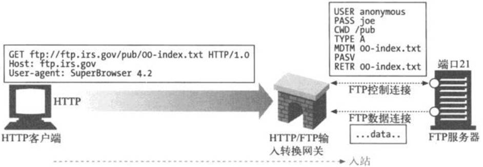
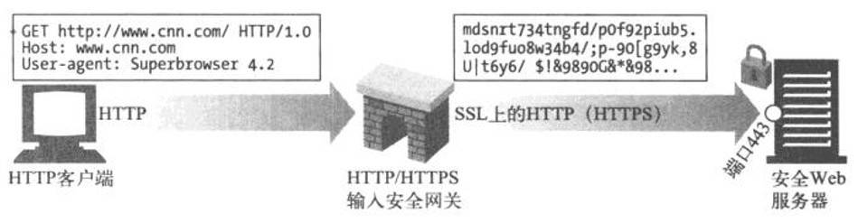
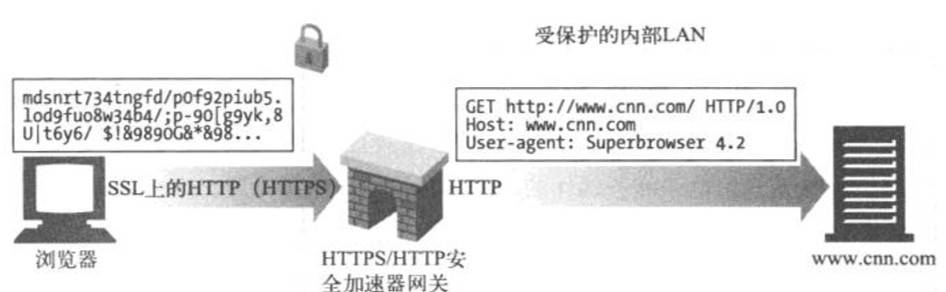
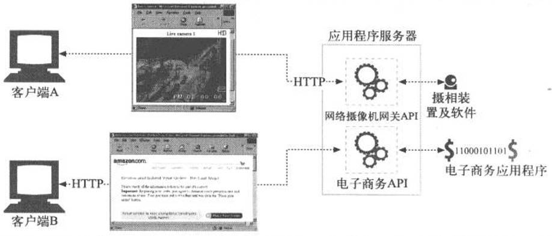
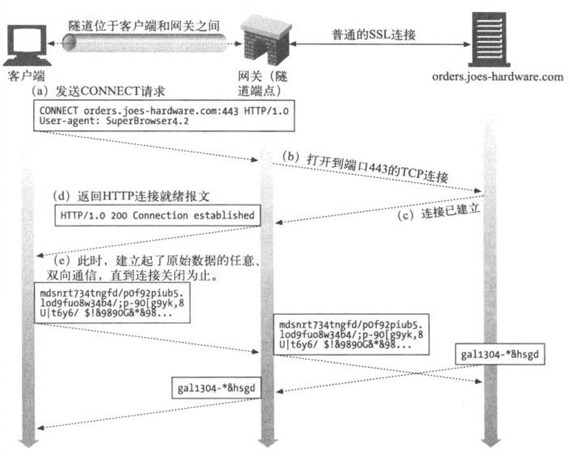
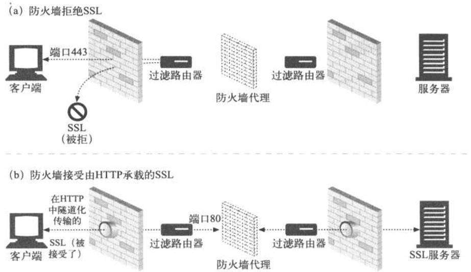

# 网关、隧道及中继

## 1 网关

HTTP扩展和接口的发展是由用户需求驱动的。要在Web上发布更复杂资源的需求出现时，人们很快就明确了一点：**单个应用程序无法处理所有这些能想到的资源**。      
为了解决这个问题，开发者提出了网关(gateway)的概念。              
网关可以作为某种**翻译器**使用，它**抽象出了一种能够到达资源的方法**。    
网关是资源和应用程序之间的粘合剂。应用程序可以**通过HTTP或其他已定义的接口请求网关**来处理某条请求，网关可以提供一条响应。       
网关可以向数据库发送査询语句，或者生成动态的内容，就像一个门一样：进去一条请求，出来一个响应.     

### 1.1 协议网关

Web网关在一侧使用HTTP协议，在另一侧使用另一种协议。可以用一个斜杠来分隔客户端和服务器端协议，并以此对网关进行描述：    

<客户端协议>/<服务器端协议>   

1. HTTP/*：服务器端Web网关

请求流入原始服务器时，服务器端Web网关会将客户端HTTP请求转换为其他协议.   
在下图中，网关收到了一条对FTP资源的HTTP请求:    

ftp://ftp.irs.gov/pub/00-index.txt   

2. HTTP/HTTPS：服务器端安全网关

一个组织可以通过网关对所有的输入Web请求加密，以提供额外的隐私和安全性保护。客户端可以用普通的HTTP浏览Web内容，但网关会自动加密用户的对话.     

 
3. HTTPS/HTTP：客户端安全加速器网关

可以将HTTPS/HTTP网关作为安全加速器使用，这些HTTPS/HTTP网关位于Web服务器之前，通常作为不可见的拦截网关或反向代理使用。    
它们接收安全的HTTPS流量，对安全流量进行解密，并向Web服务器发送普通的HTTP请求.     

### 1.2 资源网关

最常见的网关——应用程序服务器，会将目标服务器与网关结合在一个服务器中实现。应用程序服务器是服务器端网关，与客户端通过HTTP进行通信，并与服务器端的应用程序相连.

在上图中，两个客户端是通过HTTP连接到应用程序服务器的。但应用程序服务器并没有回送文件，而是将请求通过一个网关应用编程接口(Application Programming Interface, API)     
发送给运行在服务器上的应用程序.
收到客户端A的请求，根据URI将其通过API发送给一个数码相机应用程序。 将得到的图片绑定到一条HTTP响应报文中，再回送给客户端，在客户端的浏览器中显示.      
客户端B的URI请求的是一个电子商务应用程序。客户端B的请求是通过服务器网关API发送给电子商务软件的，结果会被回送给浏览器。         
电子商务软件与客户端进行交互，引导用户通过一系列HTML页面来完成购物.      
第一个流行的应用程序网关API就是通用网关接口(Common Gateway Interface, CGI)。CGI是一个标准接口集，                         
Web服务器可以用它来装载程序以响应对特定URL的HTTP请求，并收集程序的输出数据，将其放在HTTP响应中回送. 

### 1.3 CGI

CGI在Web上广泛用于动态HTML，信用卡处理以及数据库査询等任务。CGI应用程序独立于服务器，所以，几乎可以用任意语言来实现，包括Perl、Tel、C和各种shell语言。CGI很简单，几乎所有的HTTP服务器都支持它.       
CGI的处理对用户来说是不可见的。从客户端的角度来看，就像发起一个普通请求一样。它完全不清楚服务器和CGI应用程序之间的转接过程。URL中出现字符cgi和可能出现的“?”是客户端发现使用了CGI应用程序的唯一线索.    
CGI在服务器和众多的资源类型之间提供了一种简单的、函数形式的粘合方式，用来处理各种需要的转换。       
这个接口还能很好地保护服务器，防止一些糟糕的扩展对它造成的破坏(如果这些扩展直接与服务器相连，造成的错误可能会引发服务器崩溃).     
但是，这种分离会造成性能的耗费。为每条CGI请求引发一个新进程的开销是很高的，会限制那些使用CGI的服务器的性能，并且会加重服务端机器资源的负担。      
为了解决这个问题，人们开发了一种新型CGI——并将其恰当地称为快速CGI。这个接口模拟了CGI，但它是作为持久守护进程运行的，消除了为每个请求建立或拆除新进程所带来的性能损耗.           

## 2 隧道

Web隧道(Web tunnel)是HTTP的另一种用法，可以通过HTTP应用程序访问使用非HTTP协议的应用程序。Web隧道允许用户通过HTTP连接发送非HTTP流量，这样就可以在HTTP上捎带其他协议数据了。        
使用Web隧道最常见的原因就是要在HTTP连接中嵌入非HTTP流量，这样，这类流量就可以穿过只允许Web流量通过的防火墙了.

### 2.1 用Connect建立隧道

Web隧道是用HTTP的CONNECT方法建立起来的。CONNECT方法请求隧道网关创建一条到达任意目的服务器和端口的TCP连接，并对客户端和服务器之间的后继数据进行盲转发.   

在图a中，客户端发送了一条CONNECT请求给隧道网关。客户端的CONNECT方法请求隧道网关打开一条TCP连接(在这里，打开的是到主机orders.joes-hardware.com的标准SSL端口443的连接)；        
在图b和图c中创建了TCP连接；一旦建立了TCP连接，网关就会发送一条HTTP 200 Connection Established响应来通知客户端；      
此时，隧道就建立起来了。客户端通过HTTP隧道发送的所有数据都会被直接转发给输出TCP连接，服务器发送的所有数据都会通过HTTP隧道转发给客户端.          

1. CONNECT请求

除了起始行之外，CONNECT的语法与其他HTTP方法类似。一个后面跟着冒号和端口号的主机名取代了请求URI。主机和端口都必须指定：

CONNECT home.netscape.com：443 HTTP/1.0    
User-agent： Mozilla/4.0   

2. CONNECT响应

发送了请求之后，客户端会等待来自网关的响应。和普通HTTP报文一样，响应码200表示成功。按照惯例，响应中的原因短语通常被设置为“Connection Established”

HTTP/1.0 200 Connection Established              
Proxy-agent: Netscape-Proxy/1.1            

与普通HTTP响应不同，这个响应并不需要包含Content-Type首部。此时连接只是对原始字节进行转接，不再是报文的承载者，所以不需要使用内容类型.       

### 2.2 SSL隧道
最初开发Web隧道是为了通过防火墙来传输加密的SSL流量。很多组织都会将所有流量通过分组过滤路由器和代理服务器以隧道方式传输，以提升安全性。
但有些协议，比如加密SSL，其信息是加密的，无法通过传统的代理服务器转发。隧道会通过一条HTTP连接来传输SSL流置，以穿过端口80的HTTP防火墙.  

## 3 中继

中继(relay)是没有完全遵循HTTP规范的简单HTTP代理。中继负责处理HTTP中建立连接的部分，然后对字节进行盲转发.   
HTTP很复杂，所以实现基本的代理功能并对流量进行盲转发，而且不执行任何首部和方法逻辑，有时是很有用的。   
盲中继很容易实现，所以有时会提供简单的过滤、诊断或内容转换功能。但这种方式可能潜在严重的互操作问题，所以部署的时候要特别小心.   
某些简单盲中继实现中存在的一个更常见(也更声名狼藉的)问题是，由于它们无法正确处理Connection首部，所以有潜在的挂起keep-alive连接的可能.   

